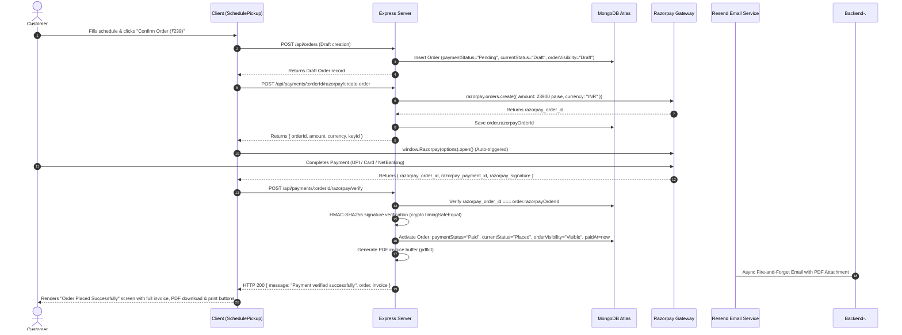

# LaundryConnect — System Architecture & Engineering Documentation

This document serves as the comprehensive architectural specification and engineering reference for **LaundryConnect**, a full-stack on-demand laundry and fabric care platform. It covers system topology, algorithmic implementations (DSA), data models, security protocols, payment gateways, asynchronous event handling, and operational procedures.

---

## 1. Project Overview

### 1.1 Problem Statement
Traditional laundry and dry cleaning services suffer from opaque turnaround times, manual paper ticketing, lack of real-time pickup/delivery tracking, and inefficient dispatching. Customers lack visibility into order status, while delivery partners waste fuel and time traveling un-optimized routes without systematic priority dispatch.

### 1.2 Solution
LaundryConnect digitizes the entire laundry lifecycle into a streamlined web platform connecting three primary user personas:
1. **Customers**: Browse services via Trie prefix search, customize quantities, schedule doorstep pickups with optional 24-hour express turnarounds, pay online via Razorpay, track garment statuses in real time via WebSockets, download tax invoices, and rate their experience.
2. **Delivery Partners**: View a priority-ranked dispatch queue, dynamically compute the shortest route across pickup/dropoff coordinates using Dijkstra's algorithm, claim orders, and broadcast live status updates.
3. **Administrators**: Manage service catalogs, configure delivery personnel profiles, oversee time-slot interval allocations, review platform revenue, and monitor the priority heap queue.

---

## 2. Technology Stack

| Layer | Technology | Version | Architectural Rationale |
|---|---|---|---|
| **Frontend Framework** | React / Vite | React 19 / Vite 8 | Fast HMR, component modularity, client-side routing, minimal bundle size |
| **Styling & Design System** | Tailwind CSS + Custom CSS Variables | Tailwind 3.4 | Centralized 4-theme visual architecture (`data-theme`), fluid animations, glassmorphism |
| **Animation Engine** | Framer Motion | 12.x | Hardware-accelerated page transitions, scroll reveals, micro-interactions |
| **Iconography** | Lucide React | 1.x | Lightweight SVG icon primitives |
| **Backend Runtime** | Node.js / Express | Node 20+ / Express 5 | Asynchronous non-blocking event loop, rich middleware ecosystem |
| **Database** | MongoDB Atlas / Mongoose | MongoDB 7.x / Mongoose 9 | Flexible document-oriented JSON schema, geospatial query capabilities, aggregation pipelines |
| **Real-Time Transport** | Socket.io | 4.8 | Bidirectional WebSocket communication with room-based pub/sub for live order tracking |
| **Payment Gateway** | Razorpay SDK | 2.9 | PCI-DSS compliant checkout with server-side HMAC-SHA256 signature verification |
| **Transactional Email** | Resend SDK | 6.28 | Modern HTTP REST email API with fail-safe, fire-and-forget asynchronous dispatch |
| **Security & Auth** | JWT (`jsonwebtoken`), `bcryptjs`, `crypto` | JWT 9, Bcrypt 3 | Stateless token authentication, salted password hashing, constant-time signature comparisons |

---

## 3. System Architecture

### 3.1 Topology & Request Flow Diagram


### 3.2 Directory Structure

```
laundryconnect/
├── client/                               # Frontend React / Vite Application
│   ├── public/                           # Static assets, hero webp variants, favicons
│   ├── src/
│   │   ├── api/
│   │   │   ├── axios.js                  # Axios client with environment-aware baseURL & JWT interceptor
│   │   │   └── socket.js                 # Socket.io client singleton
│   │   ├── components/                   # Reusable UI primitives (Navbar, ThemeSwitcher, StatusTimeline, etc.)
│   │   │   ├── InvoiceModal.jsx          # Printable tax invoice modal with cost breakdown
│   │   │   ├── Skeleton.jsx              # Shimmer loader skeletons
│   │   │   └── StarRating.jsx            # Interactive review star widget
│   │   ├── context/                      # Global context providers (AuthContext, ThemeContext)
│   │   ├── pages/
│   │   │   ├── admin/                    # Admin Dashboard (Queue, Services, Partners, Slots)
│   │   │   ├── customer/                 # Customer views (Home, Services, SchedulePickup, MyOrders, TrackOrder)
│   │   │   └── partner/                  # Partner Dashboard (Route optimization, queue claim, status update)
│   │   ├── App.jsx                       # Master router with PageTransition and route guards
│   │   └── theme.css                     # 4-theme CSS custom variables & animations
│   ├── tailwind.config.js
│   └── vite.config.js
├── server/                               # Backend Node.js / Express Application
│   ├── config/
│   │   └── db.js                         # Mongoose MongoDB connection pooling
│   ├── controllers/
│   │   ├── authController.js             # User registration, login, token generation
│   │   ├── orderController.js            # Order creation, pricing computation, queue extraction
│   │   ├── partnerController.js          # Delivery partner management
│   │   ├── paymentController.js          # Razorpay order generation, HMAC verification, invoices
│   │   ├── reviewController.js           # Order rating & partner aggregation
│   │   ├── serviceController.js          # Service catalog & Trie prefix querying
│   │   └── slotController.js             # Partner time-slot allocation & conflict resolution
│   ├── middleware/
│   │   └── auth.js                       # JWT verification (`protect`) & Role authorization (`authorize`)
│   ├── models/                           # Mongoose data schemas (User, Order, Service, DeliveryPartner, Slot)
│   ├── routes/                           # Express route definitions
│   ├── utils/                            # Algorithmic & external service modules
│   │   ├── Trie.js                       # Prefix tree data structure
│   │   ├── serviceTrie.js                # Database-backed search Trie with word tokenization
│   │   ├── PriorityQueue.js              # Binary Max-Heap priority queue implementation
│   │   ├── orderQueueService.js          # Priority score calculation & queue compilation
│   │   ├── dijkstra.js                   # MinPriorityQueue & Dijkstra single-source shortest path
│   │   ├── routeOptimizer.js             # Haversine distance matrix & greedy multi-stop TSP solver
│   │   ├── intervalScheduler.js          # Interval scheduling & conflict resolution
│   │   ├── emailService.js               # Resend transactional email module with branded templates
│   │   └── socket.js                     # Socket.io lifecycle and room broadcaster
│   ├── server.js                         # Application entrypoint & HTTP server binding
│   └── package.json
├── ARCHITECTURE.md                       # Comprehensive living architecture documentation
└── README.md
```

---

## 4. Data Models

### 4.1 User Schema (`server/models/User.js`)
Represents all system actors across customer, partner, and administrative domains.
- `name` (String, Required): Full legal or display name.
- `email` (String, Required, Unique): Normalized lowercase unique login email.
- `password` (String, Required): Bcrypt salted hash (10 salt rounds).
- `role` (String, Enum: `["customer", "partner", "admin"]`, Default: `"customer"`): Role-Based Access Control identifier.
- `phone` (String, Optional): Contact number for delivery coordination and payment receipts.
- `address` (String, Optional): Default pickup/delivery address.
- `timestamps`: Automatic `createdAt` and `updatedAt`.

### 4.2 Order Schema (`server/models/Order.js`)
The central entity modeling garment logistics, pricing breakdown, and payment states.
- `customer` (ObjectId -> `User`, Required): Owner reference.
- `services` (Array of sub-documents):
  - `service` (ObjectId -> `Service`): Targeted catalog service.
  - `quantity` (Number, Required, Min: 1): Item count or weight in kg.
- `pickupAddress` (String, Required): Doorstep collection/delivery address.
- `pickupDate` (String, Required): Validated date (YYYY-MM-DD), must be today or future.
- `pickupSlot` (ObjectId -> `Slot`, Optional): Scheduled interval slot.
- `isExpress` (Boolean, Default: `false`): Toggles 24-hour turnaround and bumps heap priority.
- `priorityScore` (Number, Default: `0`): Calculated priority score for heap ordering.
- `assignedPartner` (ObjectId -> `DeliveryPartner`, Optional): Assigned driver.
- `currentStatus` (String, Enum: `["Placed", "PickedUp", "Washing", "Ready", "OutForDelivery", "Delivered", "Cancelled"]`, Default: `"Placed"`).
- `statusHistory` (Array of `{ status, timestamp }`): Complete chronological audit log.
- `itemsSubtotal` (Number, Required): Sum of `pricePerUnit * quantity` across services.
- `deliveryCharge` (Number, Required, Default: 0): ₹49 standard charge; free if `itemsSubtotal > 349`.
- `expressFee` (Number, Required, Default: 0): ₹150 surcharge when `isExpress === true`.
- `totalAmount` (Number, Required): Authoritative total (`itemsSubtotal + deliveryCharge + expressFee`).
- `paymentStatus` (String, Enum: `["Pending", "Paid", "Failed"]`, Default: `"Pending"`).
- `paymentMethod` (String, Enum: `["UPI", "Card", "Cash", "Razorpay"]`, Default: `null`).
- `paidAt` (Date, Default: `null`): Timestamp of verified payment.
- `razorpayOrderId` (String, Default: `null`): Razorpay Order ID (`order_...`).
- `razorpayPaymentId` (String, Default: `null`): Razorpay Payment ID (`pay_...`).
- `razorpaySignature` (String, Default: `null`): Razorpay cryptographic verification signature.
- `rating` (Number, Min: 1, Max: 5, Default: `null`): Customer rating.
- `reviewComment` (String, Default: `null`): Customer review text.

### 4.3 Service Schema (`server/models/Service.js`)
Catalog of garment treatments and pricing units.
- `name` (String, Required): e.g., "Wash & Fold", "Steam Ironing", "Dry Clean".
- `category` (String, Required): e.g., "Laundry", "Dry Cleaning", "Specialty".
- `pricePerUnit` (Number, Required): Base rate per billing unit in INR.
- `unit` (String, Required): e.g., "kg", "piece", "pair".
- `description` (String): Treatment instructions and details.

### 4.4 DeliveryPartner Schema (`server/models/DeliveryPartner.js`)
Models drivers executing route logistics.
- `user` (ObjectId -> `User`, Required, Unique): Partner user reference.
- `vehicleType` (String, Enum: `["Bike", "Van", "Scooter"]`, Default: `"Bike"`).
- `currentLocation` (`{ lat: Number, lng: Number }`): Geospatial coordinate baseline.
- `isAvailable` (Boolean, Default: `true`): Dispatch readiness flag.
- `rating` (Number, Default: `5.0`): Aggregate rating recalculated on reviews.

### 4.5 Slot Schema (`server/models/Slot.js`)
Models temporal booking intervals for partners.
- `partner` (ObjectId -> `DeliveryPartner`, Required): Assigned partner.
- `date` (String, Required): Slot date (YYYY-MM-DD).
- `startTime` (String, Required): "HH:mm" 24-hr format (e.g., "09:00").
- `endTime` (String, Required): "HH:mm" 24-hr format (e.g., "11:00").
- `isBooked` (Boolean, Default: `false`).

---

## 5. Algorithmic Implementations (DSA)

LaundryConnect integrates four core Data Structures and Algorithms into production business logic:

### 5.1 Binary Priority Queue (Max-Heap) for Order Scheduling
- **Files**: [`server/utils/PriorityQueue.js`](file:///c:/Users/Pratik/laundryconnect/server/utils/PriorityQueue.js) and [`server/utils/orderQueueService.js`](file:///c:/Users/Pratik/laundryconnect/server/utils/orderQueueService.js).
- **Structure**: Array-backed binary heap maintaining max-heap order.
  - Parent: `Math.floor((i - 1) / 2)`
  - Left Child: `2 * i + 1`
  - Right Child: `2 * i + 2`
- **Priority Score Formulation**:
  $$\text{PriorityScore} = \text{BaseScore} + \text{WaitTimeBonus}$$
  $$\text{BaseScore} = \begin{cases} 100 & \text{if } \text{isExpress} = \text{true} \\ 10 & \text{otherwise} \end{cases}$$
  $$\text{WaitTimeBonus} = \left\lfloor \frac{\text{Date.now}() - \text{createdAt}}{60 \times 1000} \right\rfloor \text{ (1 point per elapsed minute)}$$
- **Complexity**:
  - Insertion (`insert`): $O(\log N)$ via `bubbleUp`.
  - Extraction (`extractMax`): $O(\log N)$ via `bubbleDown`.
  - Full inspection (`peekAllSorted`): $O(N \log N)$ non-destructive heap clone extraction.
- **Application**: Express orders instantly jump to the front of the dispatch queue, while long-waiting regular orders gradually climb the queue to eliminate starvation.

### 5.2 Interval Scheduling & Conflict Resolution
- **File**: [`server/utils/intervalScheduler.js`](file:///c:/Users/Pratik/laundryconnect/server/utils/intervalScheduler.js).
- **Algorithm**:
  - **Overlap Detection (`doesOverlap`)**: Two intervals $[S_A, E_A)$ and $[S_B, E_B)$ conflict if:
    $$S_A < E_B \quad \text{and} \quad S_B < E_A$$
  - **Conflict Detector (`hasConflict`)**: Iterates existing partner slots for a specific date in $O(M)$ time.
  - **Greedy Gap Finder (`suggestNextFreeSlot`)**: Sorts booked intervals by start time in $O(M \log M)$, scans from `dayStart` ("09:00") to `dayEnd` ("21:00"), and returns the earliest contiguous interval where $\text{gap} \ge \text{duration}$.
- **Application**: Used in `slotController.bookSlot` to prevent double-booking partners and automatically recommend the nearest available appointment window upon collision.

### 5.3 Graph Modeling & Dijkstra's Algorithm (Route Optimization)
- **Files**: [`server/utils/dijkstra.js`](file:///c:/Users/Pratik/laundryconnect/server/utils/dijkstra.js) and [`server/utils/routeOptimizer.js`](file:///c:/Users/Pratik/laundryconnect/server/utils/routeOptimizer.js).
- **Formulation**:
  - **Geodesic Distance**: Uses the **Haversine Formula** ($R = 6371\text{ km}$) to calculate real spherical surface distance between latitude/longitude points:
    $$a = \sin^2\left(\frac{\Delta \text{lat}}{2}\right) + \cos(\text{lat}_1)\cos(\text{lat}_2)\sin^2\left(\frac{\Delta \text{lng}}{2}\right)$$
    $$c = 2 \cdot \text{atan2}(\sqrt{a}, \sqrt{1-a}), \quad d = R \cdot c$$
  - **Graph Construction (`buildGraphFromStops`)**: Fully connects all delivery waypoints into an adjacency list with edge weights equal to Haversine distance in $O(V^2)$.
  - **Shortest Path (`dijkstra`)**: Solves single-source shortest path using a MinPriorityQueue in $O((V + E) \log V)$ time.
  - **Multi-Stop Traveling Salesperson (`optimizeRoute`)**: Combines Dijkstra shortest distances with a greedy nearest-neighbor selection starting from partner's origin `startLocation` to output an ordered itinerary minimizing total transit kilometers.

### 5.4 Trie (Prefix Tree) for Catalog Autocomplete
- **Files**: [`server/utils/Trie.js`](file:///c:/Users/Pratik/laundryconnect/server/utils/Trie.js) and [`server/utils/serviceTrie.js`](file:///c:/Users/Pratik/laundryconnect/server/utils/serviceTrie.js).
- **Structure**: Multi-way tree where each `TrieNode` contains:
  - `children`: Character map dictionary.
  - `isEndOfWord`: Boolean terminator.
  - `serviceIds`: `Set` of Service ObjectIds matching this prefix.
- **Tokenized Ingestion (`insertServiceTerms`)**:
  - Inserts the full service name.
  - Tokenizes strings on whitespace/delimiters (`/[\s&,-/]+/`) and indexes every sub-word (e.g. "Steam", "Ironing", "Dry", "Clean").
- **Complexity**:
  - Insertion: $O(L)$ where $L$ is word length.
  - Prefix Search (`search(prefix)`): $O(K)$ where $K$ is query length, returning matching IDs in $O(1)$ set conversion.
- **Application**: High-speed, typo-resistant service searching where typing partial queries (e.g. "iro") matches both "Ironing" and "Steam Ironing".

---

## 6. Authentication & Authorization

### 6.1 Token Lifecycle
1. User submits credentials to `POST /api/auth/login` or `POST /api/auth/register`.
2. Password comparison via `bcrypt.compare(plaintext, hash)`.
3. Server issues a signed JWT payload `{ id: user._id, role: user.role }` with 7-day expiration using `JWT_SECRET`.
4. Client stores JWT in `localStorage.getItem('token')`.
5. Client Axios interceptor ([`axios.js`](file:///c:/Users/Pratik/laundryconnect/client/src/api/axios.js)) attaches `Authorization: Bearer <token>` to all subsequent requests.

### 6.2 Middleware Architecture (`server/middleware/auth.js`)
- **`protect`**: Verifies signature via `jwt.verify(token, process.env.JWT_SECRET)`. Sets `req.user = { id, role }`. Rejects invalid/expired tokens with HTTP `401`.
- **`authorize(...roles)`**: Verifies `roles.includes(req.user.role)`. Rejects unauthorized roles with HTTP `403`.
- **In-Controller IDOR Guards**: Endpoints such as `getOrderById`, `payForOrder`, and `verifyPayment` enforce that `order.customer.toString() === req.user.id` (or caller has `admin`/`partner` status).

---

## 7. Payment Flow (Razorpay)

### 7.1 Authoritative Pricing Model
All calculations are performed exclusively on the server in [`orderController.js`](file:///c:/Users/Pratik/laundryconnect/server/controllers/orderController.js) and can never be overridden by client-sent values:
1. $\text{ItemsSubtotal} = \sum (\text{service.pricePerUnit} \times \text{quantity})$.
2. $\text{DeliveryCharge} = \begin{cases} 0 & \text{if } \text{ItemsSubtotal} > 349 \\ 49 & \text{otherwise} \end{cases}$.
3. $\text{ExpressFee} = \begin{cases} 150 & \text{if } \text{isExpress} = \text{true} \\ 0 & \text{otherwise} \end{cases}$.
4. $\text{TotalAmount} = \text{ItemsSubtotal} + \text{DeliveryCharge} + \text{ExpressFee}$.

### 7.2 End-to-End Payment-First Sequence

The platform enforces a strict **payment-first lifecycle** where orders remain in an inactive draft state until payment is verified cryptographically:



### 7.3 Security Protections
- **Signature Binding**: Enforces `order.razorpayOrderId === razorpay_order_id` to block replayed signatures from different orders.
- **Constant-Time Comparison**: Uses `crypto.timingSafeEqual` to eliminate timing side-channel vulnerabilities.
- **Queue Gating**: Unpaid draft orders (`paymentStatus: "Pending"`, `orderVisibility: "Draft"`) are strictly excluded from `buildOrderQueue()` and cannot be claimed by delivery partners.
- **Production Guard on Test Simulation**: Bypasses via `payForOrder` are blocked in production via `process.env.NODE_ENV === "production"`.

### 7.4 PDF Invoice Generation (`server/utils/invoiceGenerator.js`)
To guarantee that invoice data never drifts across different presentation surfaces, the backend maintains a **single source of truth** architecture:
- **Library**: `pdfkit` (lightweight, pure JavaScript, zero external OS font/binary dependencies — ideal for cloud hosting).
- **Core Functions**:
  1. `buildInvoiceData(order)`: Normalizes populated order metadata, company header details, customer contact info, itemized service lines, cost breakdowns, payment IDs, and tax disclaimers into a unified object.
  2. `generateInvoicePdf(order)`: Streams an A4 PDF document containing brand headers, tabular line items, formatted currency totals, payment confirmation badges, and tax declarations, returning a `Promise<Buffer>`.
- **Surfaces Served by Single Source**:
  1. *In-Browser Views*: [`InvoiceModal.jsx`](file:///c:/Users/Pratik/laundryconnect/client/src/components/InvoiceModal.jsx) and the post-confirmation screen on [`SchedulePickup.jsx`](file:///c:/Users/Pratik/laundryconnect/client/src/pages/customer/SchedulePickup.jsx).
  2. *Streamed PDF Download*: `GET /api/payments/:orderId/invoice/pdf` (streams the generated buffer with `Content-Type: application/pdf`).
  3. *Transactional Email Attachment*: Attached directly to Resend's payment receipt email as `Invoice-INV-XXXXXXXX.pdf`.
- **Production Guard on Mock Pay**: `payForOrder` (simulate test payment) checks `if (process.env.NODE_ENV === "production") return res.status(403)` to prevent production bypass.

---

## 8. Email Notifications (Resend)

All transactional emails in [`server/utils/emailService.js`](file:///c:/Users/Pratik/laundryconnect/server/utils/emailService.js) execute as asynchronous, fire-and-forget tasks wrapped in `.catch()` handlers so email delivery latency or network failures never delay or crash the primary HTTP API response.

| Email Type | Trigger Point | Recipient | Key Information Included |
|---|---|---|---|
| **Welcome Email** | `authController.register` | New Customer | Welcome message, doorstep convenience, 24-hr express overview, CTA to book |
| **Order Confirmation** | `orderController.createOrder` | Customer | Order ID, items list, subtotal, delivery charge, express fee, total amount, pickup date/address |
| **Payment Receipt** | `paymentController.verifyPayment` | Customer | Verified badge, payment ID, payment gateway, date/time paid, complete fee breakdown |
| **Status Update** | `orderController.updateOrderStatus` | Customer | Triggered **only** on `OutForDelivery` (driver on way) and `Delivered` (delivered safely) |

**Fail-Safe Simulation**: When `RESEND_API_KEY` is not configured or set to placeholder (`re_placeholder`), the service logs simulated output to the server console without throwing errors.

---

## 9. Real-Time Updates (Socket.io)

### 9.1 Server Initialization ([`server/server.js`](file:///c:/Users/Pratik/laundryconnect/server/server.js) & [`server/utils/socket.js`](file:///c:/Users/Pratik/laundryconnect/server/utils/socket.js))
- The HTTP server is created via `http.createServer(app)`.
- Socket.io is bound to the exact same server instance (`initSocket(server)`), followed by `server.listen(PORT)` to ensure WebSocket upgrade requests resolve without port conflicts.

### 9.2 Event Architecture
- **Room Joining**: `socket.emit("joinOrderRoom", orderId)` places the client into a private room keyed by `order._id`.
- **Broadcasting**: When an administrator or partner updates an order's status in `updateOrderStatus`:
  ```javascript
  getIO().to(order._id.toString()).emit("orderStatusUpdate", {
    orderId: order._id,
    status: newStatus,
    timestamp: new Date(),
  });
  ```
- **Client Consumption**: [`TrackOrder.jsx`](file:///c:/Users/Pratik/laundryconnect/client/src/pages/customer/TrackOrder.jsx) listens for `"orderStatusUpdate"` to immediately advance the visual timeline stepper without requiring page reloads.

---

## 10. Environment Variables

| Variable Name | Location | Required / Optional | Description |
|---|---|---|---|
| `PORT` | `server/.env` | Optional (Default: `5000`) | Port on which the Express server listens. |
| `MONGO_URI` | `server/.env` | **Required** | MongoDB connection URI (e.g. MongoDB Atlas cluster connection string). |
| `JWT_SECRET` | `server/.env` | **Required** | Cryptographic secret for signing and verifying JWT tokens. |
| `RAZORPAY_KEY_ID` | `server/.env` | **Required** | Razorpay Key ID (`rzp_test_...` in test mode or `rzp_live_...`). |
| `RAZORPAY_KEY_SECRET` | `server/.env` | **Required** | Razorpay Key Secret for orders creation and HMAC verification. |
| `RESEND_API_KEY` | `server/.env` | Optional | Resend API key (`re_...`) for live transactional emails. |
| `RESEND_FROM_EMAIL` | `server/.env` | Optional | Verified sender address (Default: `LaundryConnect <onboarding@resend.dev>`). |
| `CLIENT_URL` | `server/.env` | Optional | Deployed frontend origin allowed by CORS. |
| `VITE_API_URL` | `client/.env` | Optional | Overrides backend API base URL (Default: `http://localhost:5000/api` in dev). |
| `VITE_SOCKET_URL` | `client/.env` | Optional | Overrides Socket.io server connection URL (Default: `http://localhost:5000` in dev). |

---

## 11. Deployment

### 11.1 Backend Deployment (Render Web Service)
- **Environment**: Node.js Web Service.
- **Build Command**: `cd server && npm install`
- **Start Command**: `node server/server.js`
- **Configuration**:
  - Set all production environment variables (`MONGO_URI`, `JWT_SECRET`, `RAZORPAY_KEY_ID`, `RAZORPAY_KEY_SECRET`, `RESEND_API_KEY`, `NODE_ENV=production`).
  - Render automatically assigns an HTTPS URL (e.g., `https://laundryconnect-api.onrender.com`).

### 11.2 Frontend Deployment (Static Site / Vercel / Render Static)
- **Build Command**: `cd client && npm install && npm run build`
- **Publish Directory**: `client/dist`
- **Environment**: Set `VITE_API_URL=https://laundryconnect-api.onrender.com/api` and `VITE_SOCKET_URL=https://laundryconnect-api.onrender.com`.

---

## 12. Known Limitations & Future Work

1. **Simulated Geocoding Coordinates**: Delivery stop coordinates in [`PartnerDashboard.jsx`](file:///c:/Users/Pratik/laundryconnect/client/src/pages/partner/PartnerDashboard.jsx) currently sample an array of coordinates for algorithmic demonstration. Production enhancement will integrate the Google Maps Platform Geocoding API to resolve customer text addresses to exact GPS coordinates.
2. **Resend Free-Tier Sender Restriction**: Without a verified custom DNS domain, Resend requires sender address `onboarding@resend.dev` and only delivers to the account owner's email. Linking a custom domain unlocks unrestricted recipient delivery.
3. **SMS Gateway Integration**: Complementing email receipts with Twilio / Fast2SMS text notifications when drivers depart for delivery.
4. **Abandoned Draft Orders Cleanup**: When customers initiate checkout on `SchedulePickup` but dismiss the Razorpay modal or fail to complete payment, the order record persists in `currentStatus: "Draft"`, `paymentStatus: "Pending"`, and `orderVisibility: "Draft"`. While these orders are strictly excluded from the priority queue and all partner-facing dispatch dashboards, they accumulate in MongoDB. A planned enhancement is a background cron worker or a MongoDB TTL index on unverified draft orders older than 48 hours to automatically purge abandoned records.

---

## 13. Changelog

### 2026-09-24
- **PAYMENT-FIRST ORDER FLOW RESTRUCTURING**:
  - *Previous Flow*: `Confirm Order` immediately set `currentStatus="Placed"` and showed a success screen regardless of payment. Unpaid orders accumulated in the system and were accessible before payment.
  - *New Payment-First Flow*: `createOrder` initializes orders with `currentStatus: "Draft"`, `orderVisibility: "Draft"`, and `paymentStatus: "Pending"`. The frontend auto-triggers the Razorpay checkout modal immediately upon clicking "Confirm Order".
  - *Queue Gating*: Updated [`orderQueueService.js`](file:///c:/Users/Pratik/laundryconnect/server/utils/orderQueueService.js) to query `{ currentStatus: "Placed", paymentStatus: "Paid", orderVisibility: "Visible" }`. Unpaid draft orders can never enter the Max-Heap priority queue.
  - *Order Activation*: In [`paymentController.js`](file:///c:/Users/Pratik/laundryconnect/server/controllers/paymentController.js) (`verifyPayment`), successful HMAC-SHA256 verification officially transitions the order to `paymentStatus: "Paid"`, `currentStatus: "Placed"`, `orderVisibility: "Visible"`, and records `paidAt`.
  - *Cancellation & Retry Handling*: If checkout is dismissed or payment fails, the user is presented with a non-destructive "Retry Payment" state for that same order ID, preventing duplicate order records.
  - *Files Touched*: [`Order.js`](file:///c:/Users/Pratik/laundryconnect/server/models/Order.js), [`orderController.js`](file:///c:/Users/Pratik/laundryconnect/server/controllers/orderController.js), [`orderQueueService.js`](file:///c:/Users/Pratik/laundryconnect/server/utils/orderQueueService.js), [`paymentController.js`](file:///c:/Users/Pratik/laundryconnect/server/controllers/paymentController.js), [`paymentRoutes.js`](file:///c:/Users/Pratik/laundryconnect/server/routes/paymentRoutes.js), [`SchedulePickup.jsx`](file:///c:/Users/Pratik/laundryconnect/client/src/pages/customer/SchedulePickup.jsx), [`MyOrders.jsx`](file:///c:/Users/Pratik/laundryconnect/client/src/pages/customer/MyOrders.jsx).
- **PDF INVOICE GENERATION & STREAMING (`pdfkit`)**:
  - *Implementation*: Created [`invoiceGenerator.js`](file:///c:/Users/Pratik/laundryconnect/server/utils/invoiceGenerator.js) using lightweight pure-JavaScript `pdfkit` (installing zero external native dependencies, ideal for Render deployments).
  - *Single Source of Truth*: `buildInvoiceData` unifies invoice structures across JSON APIs, PDF downloads, and email attachments, ensuring byte-for-byte matching numbers, line items, transaction IDs, and tax notes.
  - *Endpoints*: Added `GET /api/payments/:orderId/invoice/pdf` with strict IDOR ownership checks to stream generated PDFs directly to client downloaders.
  - *UI*: Added "Download Invoice (PDF)" and "Print Invoice" buttons to [`SchedulePickup.jsx`](file:///c:/Users/Pratik/laundryconnect/client/src/pages/customer/SchedulePickup.jsx) and [`InvoiceModal.jsx`](file:///c:/Users/Pratik/laundryconnect/client/src/components/InvoiceModal.jsx).
- **AUTOMATIC TRANSACTIONAL EMAIL WITH PDF ATTACHMENT (Resend)**:
  - *Implementation*: Extended [`emailService.js`](file:///c:/Users/Pratik/laundryconnect/server/utils/emailService.js) (`safeSendEmail` and `sendPaymentReceiptEmail`) to dynamically attach generated PDF buffers as `Invoice-INV-XXXXXXXX.pdf` via Resend's attachments API.
  - *Fail-Safe*: Wrapped asynchronously in fire-and-forget try/catch blocks so email or PDF attachment failures never block or fail the customer payment verification response.

### 2026-09-23
- **CRITICAL BUG FIX — Order Pricing Desync (Part 1)**:
  - *Root Cause*: `orderController.createOrder` computed only raw item subtotal, completely omitting the ₹49 delivery charge and ₹150 express fee. The `Order` model had no schema fields to persist cost breakdown.
  - *Fix Applied*: Added `itemsSubtotal`, `deliveryCharge`, and `expressFee` fields to [`Order.js`](file:///c:/Users/Pratik/laundryconnect/server/models/Order.js). Implemented authoritative backend calculation in [`orderController.js`](file:///c:/Users/Pratik/laundryconnect/server/controllers/orderController.js) with sanity validation. Updated [`SchedulePickup.jsx`](file:///c:/Users/Pratik/laundryconnect/client/src/pages/customer/SchedulePickup.jsx), [`MyOrders.jsx`](file:///c:/Users/Pratik/laundryconnect/client/src/pages/customer/MyOrders.jsx), [`TrackOrder.jsx`](file:///c:/Users/Pratik/laundryconnect/client/src/pages/customer/TrackOrder.jsx), [`InvoiceModal.jsx`](file:///c:/Users/Pratik/laundryconnect/client/src/components/InvoiceModal.jsx), and [`emailService.js`](file:///c:/Users/Pratik/laundryconnect/server/utils/emailService.js) to display the complete cost breakdown.
- **SECURITY & AUDIT FIXES (Part 2)**:
  - *Payment Replay Protection*: Bound `order.razorpayOrderId === razorpay_order_id` and applied constant-time signature comparison using `crypto.timingSafeEqual` in [`paymentController.js`](file:///c:/Users/Pratik/laundryconnect/server/controllers/paymentController.js).
  - *Production Guard on Test Simulation*: Blocked `payForOrder` when `NODE_ENV === "production"`, and hid simulation button in client production builds.
  - *IDOR Protection*: Restricted `getOrderById` to the order's customer, administrator, or delivery partner.
  - *Partner Authorization*: Enforced that partners can only update statuses of orders assigned to them (or claim unassigned orders upon pickup).
  - *Socket.io Port Collision Fix*: Changed `app.listen(PORT)` to `server.listen(PORT)` in [`server.js`](file:///c:/Users/Pratik/laundryconnect/server/server.js).
  - *Trie Tokenization*: Enhanced [`serviceTrie.js`](file:///c:/Users/Pratik/laundryconnect/server/utils/serviceTrie.js) to tokenize sub-words, allowing queries like "iro" to match "Steam Ironing".
- **ARCHITECTURE DOCUMENTATION (Part 3)**:
  - Authored comprehensive [`ARCHITECTURE.md`](file:///c:/Users/Pratik/laundryconnect/ARCHITECTURE.md) covering all system modules, DSA specifications, security models, and workflows.
