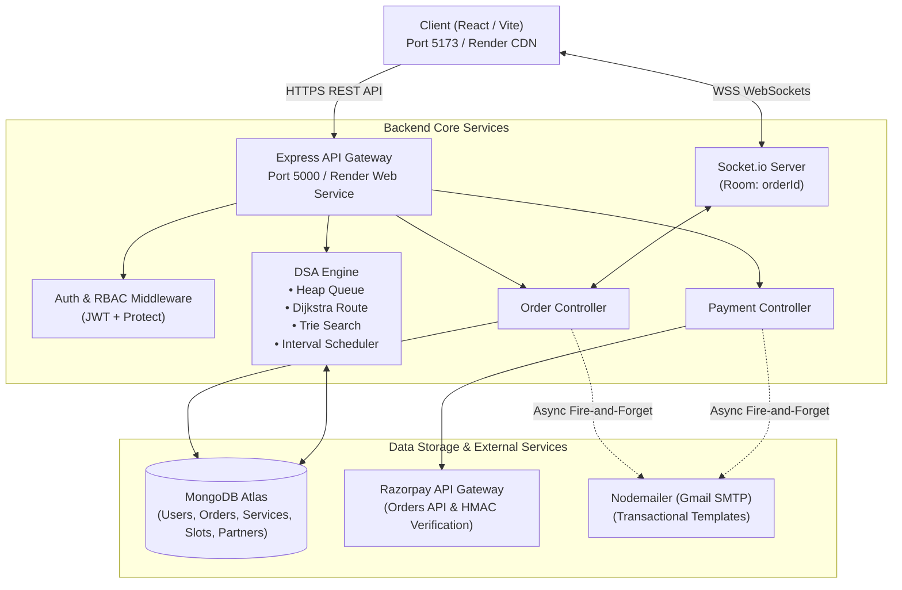
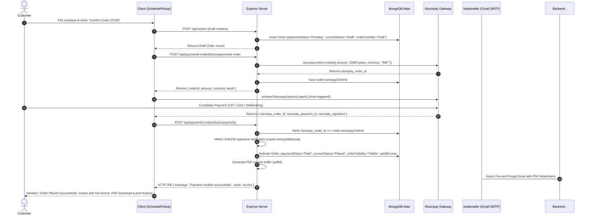

# LaundryConnect — System Architecture & Engineering Documentation

This document serves as the comprehensive architectural specification and engineering reference for **LaundryConnect**, a full-stack on-demand laundry and fabric care platform. It covers system topology, algorithmic implementations (DSA), data models, security protocols, payment gateways, asynchronous event handling, and operational procedures.

---

## 1. Project Overview

### 1.1 Problem Statement
Traditional laundry and dry cleaning services suffer from opaque turnaround times, manual paper ticketing, lack of real-time pickup/delivery tracking, and inefficient dispatching. Customers lack visibility into order status, while delivery partners waste fuel and time traveling un-optimized routes without systematic priority dispatch.

### 1.2 Solution
LaundryConnect digitizes the entire laundry lifecycle into a streamlined web platform connecting three primary user personas:
1. **Customers**: Browse services via Trie prefix search, customize quantities, schedule doorstep pickups with optional 24-hour express turnarounds, pay online via Razorpay, track garment statuses in real time via WebSockets, download tax invoices, and rate their experience.
2. **Delivery Partners**: View a priority-ranked dispatch queue, dynamically compute the shortest route across pickup/dropoff coordinates using Dijkstra's algorithm, claim orders, and broadcast live status updates.
3. **Administrators**: Manage service catalogs, configure delivery personnel profiles, oversee time-slot interval allocations, review platform revenue, and monitor the priority heap queue.

---

## 2. Technology Stack

| Layer | Technology | Version | Architectural Rationale |
|---|---|---|---|
| **Frontend Framework** | React / Vite | React 19 / Vite 8 | Fast HMR, component modularity, client-side routing, minimal bundle size |
| **Styling & Design System** | Tailwind CSS + Custom CSS Variables | Tailwind 3.4 | Centralized 4-theme visual architecture (`data-theme`), fluid animations, glassmorphism |
| **Animation Engine** | Framer Motion | 12.x | Hardware-accelerated page transitions, scroll reveals, micro-interactions |
| **Iconography** | Lucide React | 1.x | Lightweight SVG icon primitives |
| **Backend Runtime** | Node.js / Express | Node 20+ / Express 5 | Asynchronous non-blocking event loop, rich middleware ecosystem |
| **Database** | MongoDB Atlas / Mongoose | MongoDB 7.x / Mongoose 9 | Flexible document-oriented JSON schema, geospatial query capabilities, aggregation pipelines |
| **Real-Time Transport** | Socket.io | 4.8 | Bidirectional WebSocket communication with room-based pub/sub for live order tracking |
| **Payment Gateway** | Razorpay SDK | 2.9 | PCI-DSS compliant checkout with server-side HMAC-SHA256 signature verification |
| **Transactional Email** | Nodemailer (Gmail SMTP) | 10.x | Direct SMTP transport for unrestricted recipient inbox delivery, attachments support, zero domain cost |
| **Security & Auth** | JWT (`jsonwebtoken`), `bcryptjs`, `crypto` | JWT 9, Bcrypt 3 | Stateless token authentication, salted password hashing, constant-time signature comparisons |

---

## 3. System Architecture

### 3.1 Topology & Request Flow Diagram



### 3.2 Directory Structure

```
laundryconnect/
├── client/                               # Frontend React / Vite Application
│   ├── public/                           # Static assets, hero webp variants, favicons
│   ├── src/
│   │   ├── api/
│   │   │   ├── axios.js                  # Axios client with environment-aware baseURL & JWT interceptor
│   │   │   └── socket.js                 # Socket.io client singleton
│   │   ├── components/                   # Reusable UI primitives (Navbar, ThemeSwitcher, StatusTimeline, etc.)
│   │   │   ├── InvoiceModal.jsx          # Printable tax invoice modal with cost breakdown
│   │   │   ├── Skeleton.jsx              # Shimmer loader skeletons
│   │   │   └── StarRating.jsx            # Interactive review star widget
│   │   ├── context/                      # Global context providers (AuthContext, ThemeContext)
│   │   ├── pages/
│   │   │   ├── admin/                    # Admin Dashboard (Queue, Services, Partners, Slots)
│   │   │   ├── customer/                 # Customer views (Home, Services, SchedulePickup, MyOrders, TrackOrder)
│   │   │   └── partner/                  # Partner Dashboard (Route optimization, queue claim, status update)
│   │   ├── App.jsx                       # Master router with PageTransition and route guards
│   │   └── theme.css                     # 4-theme CSS custom variables & animations
│   ├── tailwind.config.js
│   └── vite.config.js
├── server/                               # Backend Node.js / Express Application
│   ├── config/
│   │   └── db.js                         # Mongoose MongoDB connection pooling
│   ├── controllers/
│   │   ├── authController.js             # User registration, login, token generation
│   │   ├── orderController.js            # Order creation, pricing computation, queue extraction
│   │   ├── partnerController.js          # Delivery partner management
│   │   ├── paymentController.js          # Razorpay order generation, HMAC verification, invoices
│   │   ├── reviewController.js           # Order rating & partner aggregation
│   │   ├── serviceController.js          # Service catalog & Trie prefix querying
│   │   └── slotController.js             # Partner time-slot allocation & conflict resolution
│   ├── middleware/
│   │   └── auth.js                       # JWT verification (`protect`) & Role authorization (`authorize`)
│   ├── models/                           # Mongoose data schemas (User, Order, Service, DeliveryPartner, Slot)
│   ├── routes/                           # Express route definitions
│   ├── utils/                            # Algorithmic & external service modules
│   │   ├── Trie.js                       # Prefix tree data structure
│   │   ├── serviceTrie.js                # Database-backed search Trie with word tokenization
│   │   ├── PriorityQueue.js              # Binary Max-Heap priority queue implementation
│   │   ├── orderQueueService.js          # Priority score calculation & queue compilation
│   │   ├── dijkstra.js                   # MinPriorityQueue & Dijkstra single-source shortest path
│   │   ├── routeOptimizer.js             # Haversine distance matrix & greedy multi-stop TSP solver
│   │   ├── intervalScheduler.js          # Interval scheduling & conflict resolution
│   │   ├── emailService.js               # Resend transactional email module with branded templates
│   │   └── socket.js                     # Socket.io lifecycle and room broadcaster
│   ├── server.js                         # Application entrypoint & HTTP server binding
│   └── package.json
├── ARCHITECTURE.md                       # Comprehensive living architecture documentation
└── README.md
```

---

## 4. Data Models

### 4.1 User Schema (`server/models/User.js`)
Represents all system actors across customer, partner, and administrative domains.
- `name` (String, Required): Full legal or display name.
- `email` (String, Required, Unique): Normalized lowercase unique login email.
- `password` (String, Required): Bcrypt salted hash (10 salt rounds).
- `role` (String, Enum: `["customer", "partner", "admin"]`, Default: `"customer"`): Role-Based Access Control identifier.
- `phone` (String, Optional): Contact number for delivery coordination and payment receipts.
- `address` (String, Optional): Default pickup/delivery address.
- `timestamps`: Automatic `createdAt` and `updatedAt`.

### 4.2 Order Schema (`server/models/Order.js`)
The central entity modeling garment logistics, pricing breakdown, and payment states.
- `customer` (ObjectId -> `User`, Required): Owner reference.
- `services` (Array of sub-documents):
  - `service` (ObjectId -> `Service`): Targeted catalog service.
  - `quantity` (Number, Required, Min: 1): Item count or weight in kg.
- `pickupAddress` (String, Required): Doorstep collection/delivery address.
- `pickupDate` (String, Required): Validated date (YYYY-MM-DD), must be today or future.
- `pickupSlot` (ObjectId -> `Slot`, Optional): Scheduled interval slot.
- `isExpress` (Boolean, Default: `false`): Toggles 24-hour turnaround and bumps heap priority.
- `priorityScore` (Number, Default: `0`): Calculated priority score for heap ordering.
- `assignedPartner` (ObjectId -> `DeliveryPartner`, Optional): Assigned driver.
- `currentStatus` (String, Enum: `["Placed", "PickedUp", "Washing", "Ready", "OutForDelivery", "Delivered", "Cancelled"]`, Default: `"Placed"`).
- `statusHistory` (Array of `{ status, timestamp }`): Complete chronological audit log.
- `itemsSubtotal` (Number, Required): Sum of `pricePerUnit * quantity` across services.
- `deliveryCharge` (Number, Required, Default: 0): Authoritative distance-tiered fee; free if `itemsSubtotal > 349`.
- `deliveryDistanceKm` (Number, Default: 0): Computed spherical distance from central facility hub in kilometers.
- `expressFee` (Number, Required, Default: 0): ₹150 surcharge when `isExpress === true`.
- `totalAmount` (Number, Required): Authoritative total (`itemsSubtotal + deliveryCharge + expressFee`).
- `paymentStatus` (String, Enum: `["Pending", "Paid", "Failed"]`, Default: `"Pending"`).
- `paymentMethod` (String, Enum: `["UPI", "Card", "Cash", "Razorpay"]`, Default: `null`).
- `paidAt` (Date, Default: `null`): Timestamp of verified payment.
- `razorpayOrderId` (String, Default: `null`): Razorpay Order ID (`order_...`).
- `razorpayPaymentId` (String, Default: `null`): Razorpay Payment ID (`pay_...`).
- `razorpaySignature` (String, Default: `null`): Razorpay cryptographic verification signature.
- `rating` (Number, Min: 1, Max: 5, Default: `null`): Customer rating.
- `reviewComment` (String, Default: `null`): Customer review text.

### 4.3 Service Schema (`server/models/Service.js`)
Catalog of garment treatments and pricing units.
- `name` (String, Required): e.g., "Wash & Fold", "Steam Ironing", "Dry Clean".
- `category` (String, Required): e.g., "Laundry", "Dry Cleaning", "Specialty".
- `pricePerUnit` (Number, Required): Base rate per billing unit in INR.
- `unit` (String, Required): e.g., "kg", "piece", "pair".
- `description` (String): Treatment instructions and details.

### 4.4 DeliveryPartner Schema (`server/models/DeliveryPartner.js`)
Models drivers executing route logistics.
- `user` (ObjectId -> `User`, Required, Unique): Partner user reference.
- `vehicleType` (String, Enum: `["Bike", "Van", "Scooter"]`, Default: `"Bike"`).
- `currentLocation` (`{ lat: Number, lng: Number }`): Geospatial coordinate baseline.
- `isAvailable` (Boolean, Default: `true`): Dispatch readiness flag.
- `rating` (Number, Default: `5.0`): Aggregate rating recalculated on reviews.

### 4.5 Slot Schema (`server/models/Slot.js`)
Models temporal booking intervals for partners.
- `partner` (ObjectId -> `DeliveryPartner`, Required): Assigned partner.
- `date` (String, Required): Slot date (YYYY-MM-DD).
- `startTime` (String, Required): "HH:mm" 24-hr format (e.g., "09:00").
- `endTime` (String, Required): "HH:mm" 24-hr format (e.g., "11:00").
- `isBooked` (Boolean, Default: `false`).

---

## 5. Algorithmic Implementations (DSA)

LaundryConnect integrates four core Data Structures and Algorithms into production business logic:

### 5.1 Binary Priority Queue (Max-Heap) for Order Scheduling
- **Files**: [`server/utils/PriorityQueue.js`](file:///c:/Users/Pratik/laundryconnect/server/utils/PriorityQueue.js) and [`server/utils/orderQueueService.js`](file:///c:/Users/Pratik/laundryconnect/server/utils/orderQueueService.js).
- **Structure**: Array-backed binary heap maintaining max-heap order.
  - Parent: `Math.floor((i - 1) / 2)`
  - Left Child: `2 * i + 1`
  - Right Child: `2 * i + 2`
- **Priority Score Formulation**:
  $$\text{PriorityScore} = \text{BaseScore} + \text{WaitTimeBonus}$$
  $$\text{BaseScore} = \begin{cases} 100 & \text{if } \text{isExpress} = \text{true} \\ 10 & \text{otherwise} \end{cases}$$
  $$\text{WaitTimeBonus} = \left\lfloor \frac{\text{Date.now}() - \text{createdAt}}{60 \times 1000} \right\rfloor \text{ (1 point per elapsed minute)}$$
- **Complexity**:
  - Insertion (`insert`): $O(\log N)$ via `bubbleUp`.
  - Extraction (`extractMax`): $O(\log N)$ via `bubbleDown`.
  - Full inspection (`peekAllSorted`): $O(N \log N)$ non-destructive heap clone extraction.
- **Application**: Express orders instantly jump to the front of the dispatch queue, while long-waiting regular orders gradually climb the queue to eliminate starvation.

### 5.2 Interval Scheduling & Conflict Resolution
- **File**: [`server/utils/intervalScheduler.js`](file:///c:/Users/Pratik/laundryconnect/server/utils/intervalScheduler.js).
- **Algorithm**:
  - **Overlap Detection (`doesOverlap`)**: Two intervals $[S_A, E_A)$ and $[S_B, E_B)$ conflict if:
    $$S_A < E_B \quad \text{and} \quad S_B < E_A$$
  - **Conflict Detector (`hasConflict`)**: Iterates existing partner slots for a specific date in $O(M)$ time.
  - **Greedy Gap Finder (`suggestNextFreeSlot`)**: Sorts booked intervals by start time in $O(M \log M)$, scans from `dayStart` ("09:00") to `dayEnd` ("21:00"), and returns the earliest contiguous interval where $\text{gap} \ge \text{duration}$.
- **Application**: Used in `slotController.bookSlot` to prevent double-booking partners and automatically recommend the nearest available appointment window upon collision.

### 5.3 Graph Modeling & Dijkstra's Algorithm (Route Optimization)
- **Files**: [`server/utils/dijkstra.js`](file:///c:/Users/Pratik/laundryconnect/server/utils/dijkstra.js) and [`server/utils/routeOptimizer.js`](file:///c:/Users/Pratik/laundryconnect/server/utils/routeOptimizer.js).
- **Formulation**:
  - **Geodesic Distance**: Uses the **Haversine Formula** ($R = 6371\text{ km}$) to calculate real spherical surface distance between latitude/longitude points:
    $$a = \sin^2\left(\frac{\Delta \text{lat}}{2}\right) + \cos(\text{lat}_1)\cos(\text{lat}_2)\sin^2\left(\frac{\Delta \text{lng}}{2}\right)$$
    $$c = 2 \cdot \text{atan2}(\sqrt{a}, \sqrt{1-a}), \quad d = R \cdot c$$
  - **Graph Construction (`buildGraphFromStops`)**: Fully connects all delivery waypoints into an adjacency list with edge weights equal to Haversine distance in $O(V^2)$.
  - **Shortest Path (`dijkstra`)**: Solves single-source shortest path using a MinPriorityQueue in $O((V + E) \log V)$ time.
  - **Multi-Stop Traveling Salesperson (`optimizeRoute`)**: Combines Dijkstra shortest distances with a greedy nearest-neighbor selection starting from partner's origin `startLocation` to output an ordered itinerary minimizing total transit kilometers.

### 5.4 Trie (Prefix Tree) for Catalog Autocomplete
- **Files**: [`server/utils/Trie.js`](file:///c:/Users/Pratik/laundryconnect/server/utils/Trie.js) and [`server/utils/serviceTrie.js`](file:///c:/Users/Pratik/laundryconnect/server/utils/serviceTrie.js).
- **Structure**: Multi-way tree where each `TrieNode` contains:
  - `children`: Character map dictionary.
  - `isEndOfWord`: Boolean terminator.
  - `serviceIds`: `Set` of Service ObjectIds matching this prefix.
- **Tokenized Ingestion (`insertServiceTerms`)**:
  - Inserts the full service name.
  - Tokenizes strings on whitespace/delimiters (`/[\s&,-/]+/`) and indexes every sub-word (e.g. "Steam", "Ironing", "Dry", "Clean").
- **Complexity**:
  - Insertion: $O(L)$ where $L$ is word length.
  - Prefix Search (`search(prefix)`): $O(K)$ where $K$ is query length, returning matching IDs in $O(1)$ set conversion.
- **Application**: High-speed, typo-resistant service searching where typing partial queries (e.g. "iro") matches both "Ironing" and "Steam Ironing".

---

## 6. Authentication & Authorization

### 6.1 Token Lifecycle
1. User submits credentials to `POST /api/auth/login` or `POST /api/auth/register`.
2. Password comparison via `bcrypt.compare(plaintext, hash)`.
3. Server issues a signed JWT payload `{ id: user._id, role: user.role }` with 7-day expiration using `JWT_SECRET`.
4. Client stores JWT in `localStorage.getItem('token')`.
5. Client Axios interceptor ([`axios.js`](file:///c:/Users/Pratik/laundryconnect/client/src/api/axios.js)) attaches `Authorization: Bearer <token>` to all subsequent requests.

### 6.2 Middleware Architecture (`server/middleware/auth.js`)
- **`protect`**: Verifies signature via `jwt.verify(token, process.env.JWT_SECRET)`. Sets `req.user = { id, role }`. Rejects invalid/expired tokens with HTTP `401`.
- **`authorize(...roles)`**: Verifies `roles.includes(req.user.role)`. Rejects unauthorized roles with HTTP `403`.
- **In-Controller IDOR Guards**: Endpoints such as `getOrderById`, `payForOrder`, and `verifyPayment` enforce that `order.customer.toString() === req.user.id` (or caller has `admin`/`partner` status).

---

## 7. Payment Flow (Razorpay)

### 7.1 Authoritative Pricing Model
All calculations are performed exclusively on the server in [`orderController.js`](file:///c:/Users/Pratik/laundryconnect/server/controllers/orderController.js) and can never be overridden by client-sent values:
1. $\text{ItemsSubtotal} = \sum (\text{service.pricePerUnit} \times \text{quantity})$.
2. $\text{DistanceKm} = \text{Haversine}(\text{HUB}, \text{PickupLocation})$.
3. $\text{ExtraKm} = \max(0, \lceil \text{DistanceKm} - \text{BASE\_INCLUDED\_KM} \rceil)$, where $\text{BASE\_INCLUDED\_KM} = 3\text{ km}$.
4. $\text{RawDeliveryCharge} = \text{BASE\_DELIVERY\_CHARGE} + (\text{ExtraKm} \times \text{PER\_KM\_RATE})$, where $\text{BASE\_DELIVERY\_CHARGE} = ₹20$ and $\text{PER\_KM\_RATE} = ₹8/\text{km}$.
5. $\text{DeliveryCharge} = \begin{cases} 0 & \text{if } \text{ItemsSubtotal} > 349 \\ \text{RawDeliveryCharge} & \text{otherwise} \end{cases}$.
6. $\text{ExpressFee} = \begin{cases} 150 & \text{if } \text{isExpress} = \text{true} \\ 0 & \text{otherwise} \end{cases}$.
7. $\text{TotalAmount} = \text{ItemsSubtotal} + \text{DeliveryCharge} + \text{ExpressFee}$.

### 7.2 End-to-End Payment-First Sequence

The platform enforces a strict **payment-first lifecycle** where orders remain in an inactive draft state until payment is verified cryptographically:



### 7.3 Security Protections
- **Signature Binding**: Enforces `order.razorpayOrderId === razorpay_order_id` to block replayed signatures from different orders.
- **Constant-Time Comparison**: Uses `crypto.timingSafeEqual` to eliminate timing side-channel vulnerabilities.
- **Queue Gating**: Unpaid draft orders (`paymentStatus: "Pending"`, `orderVisibility: "Draft"`) are strictly excluded from `buildOrderQueue()` and cannot be claimed by delivery partners.
- **Production Guard on Test Simulation**: Bypasses via `payForOrder` are blocked in production via `process.env.NODE_ENV === "production"`.

### 7.4 PDF Invoice Generation (`server/utils/invoiceGenerator.js`)
To guarantee that invoice data never drifts across different presentation surfaces, the backend maintains a **single source of truth** architecture:
- **Library**: `pdfkit` (lightweight, pure JavaScript, zero external OS font/binary dependencies — ideal for cloud hosting).
- **Core Functions**:
  1. `buildInvoiceData(order)`: Normalizes populated order metadata, company header details, customer contact info, itemized service lines, cost breakdowns, payment IDs, and tax disclaimers into a unified object.
  2. `generateInvoicePdf(order)`: Streams an A4 PDF document containing brand headers, tabular line items, formatted currency totals, payment confirmation badges, and tax declarations, returning a `Promise<Buffer>`.
- **Surfaces Served by Single Source**:
  1. *In-Browser Views*: [`InvoiceModal.jsx`](file:///c:/Users/Pratik/laundryconnect/client/src/components/InvoiceModal.jsx) and the post-confirmation screen on [`SchedulePickup.jsx`](file:///c:/Users/Pratik/laundryconnect/client/src/pages/customer/SchedulePickup.jsx).
  2. *Streamed PDF Download*: `GET /api/payments/:orderId/invoice/pdf` (streams the generated buffer with `Content-Type: application/pdf`).
  3. *Transactional Email Attachment*: Attached directly to Nodemailer's payment receipt email as `Invoice-INV-XXXXXXXX.pdf`.
- **Production Guard on Mock Pay**: `payForOrder` (simulate test payment) checks `if (process.env.NODE_ENV === "production") return res.status(403)` to prevent production bypass.

---

## 8. Email Notifications (Nodemailer / Gmail SMTP)

All transactional emails in [`server/utils/emailService.js`](file:///c:/Users/Pratik/laundryconnect/server/utils/emailService.js) execute as asynchronous, fire-and-forget tasks wrapped in `.catch()` handlers so email delivery latency or network failures never delay or crash the primary HTTP API response.

The platform uses **Nodemailer** with **Gmail SMTP** (`service: "gmail"`) authenticated via Google Account App Passwords. Unlike free-tier API services (such as Resend's default sandbox which only delivers to the account owner), Gmail SMTP delivers to **any customer email address** with zero custom domain or DNS setup required.

| Email Type | Trigger Point | Recipient | Key Information Included |
|---|---|---|---|
| **Welcome Email** | `authController.register` | New Customer | Welcome message, doorstep convenience, 24-hr express overview, CTA to book |
| **Order Confirmation** | `orderController.createOrder` | Customer | Order ID, items list, subtotal, delivery charge, express fee, total amount, pickup date/address |
| **Payment Receipt** | `paymentController.verifyPayment` | Customer | Verified badge, payment ID, payment gateway, date/time paid, complete fee breakdown, and **attached PDF invoice** |
| **Status Update** | `orderController.updateOrderStatus` | Customer | Triggered **only** on `OutForDelivery` (driver on way) and `Delivered` (delivered safely) |

**Fail-Safe Simulation**: When `GMAIL_USER` or `GMAIL_APP_PASSWORD` are not configured or set to placeholders, the service safely logs simulated output and attachment counts to the server console without throwing errors.

**Delivery Constraints**: Standard Gmail accounts have an outbound sending limit of approximately 500 emails per 24-hour period. This is well within the operating requirements of academic demonstration and staging environments. For high-volume enterprise production, swapping the transporter to Amazon SES, SendGrid, or Google Workspace SMTP relay requires only changing the transporter config in `emailService.js`.

---

## 9. Real-Time Updates (Socket.io)

### 9.1 Server Initialization ([`server/server.js`](file:///c:/Users/Pratik/laundryconnect/server/server.js) & [`server/utils/socket.js`](file:///c:/Users/Pratik/laundryconnect/server/utils/socket.js))
- The HTTP server is created via `http.createServer(app)`.
- Socket.io is bound to the exact same server instance (`initSocket(server)`), followed by `server.listen(PORT)` to ensure WebSocket upgrade requests resolve without port conflicts.

### 9.2 Event Architecture

#### 1. Room Management
- **Room Joining**: `socket.emit("joinOrderRoom", orderId)` places client sockets into an isolated room keyed by `orderId`. Both customer tracking clients and partner dashboards join the specific order's room.

#### 2. Order Status Progression (`orderStatusUpdate`)
- **Broadcasting**: When an administrator or assigned delivery partner updates an order's status in `updateOrderStatus`:
  ```javascript
  getIO().to(order._id.toString()).emit("orderStatusUpdate", {
    orderId: order._id,
    status: newStatus,
    timestamp: new Date(),
  });
  ```
- **Client Consumption**: [`TrackOrder.jsx`](file:///c:/Users/Pratik/laundryconnect/client/src/pages/customer/TrackOrder.jsx) listens for `"orderStatusUpdate"` to dynamically advance the visual timeline stepper in real time.

#### 3. Live Partner Location Streaming (`updateLocation` & `partnerLocation`)
- **Incoming Socket Event**: `socket.on("updateLocation", async ({ orderId, lat, lng, token }) => { ... })`
- **Multi-Layer Cryptographic Authorization**:
  1. *Token Verification*: Verifies `token` against `JWT_SECRET` using `jwt.verify`. Rejects expired or tampered signatures.
  2. *Role Enforcement*: Validates `decoded.role === "partner"`. Customers and unauthenticated sockets are barred from broadcasting.
  3. *Assignment Verification*: Loads `Order.findById(orderId)` and resolves the partner's `DeliveryPartner` profile. Confirms that `order.assignedPartner` strictly matches `decoded.id` (or the partner document `_id`). Unassigned partners attempting to spoof coordinates for other orders are silently dropped and logged.
- **Outgoing Broadcast**:
  ```javascript
  getIO().to(orderId.toString()).emit("partnerLocation", {
    lat,
    lng,
    timestamp: new Date(),
  });
  ```
- **Database Persistence**: Updates `DeliveryPartner.currentLocation = { lat, lng }` on every valid update. When a customer navigates to `TrackOrder.jsx`, `getOrderById` supplies this pre-stored coordinate on initial page load before live socket updates stream.

### 9.3 OpenStreetMap & Geocoding Architecture
- **Map Engine**: Built with Leaflet & React-Leaflet (`react-leaflet` v5) rendering free OpenStreetMap tiles (`https://{s}.tile.openstreetmap.org/{z}/{x}/{y}.png`).
- **Nominatim Server-Side Geocoding**:
  - Module: [`server/utils/geocoder.js`](file:///c:/Users/Pratik/laundryconnect/server/utils/geocoder.js).
  - Queries `https://nominatim.openstreetmap.org/search?format=json&q=<address>` using a dedicated `User-Agent: LaundryConnect/1.0` header and rate-limit backoff (~1 req/sec).
  - Caches resolved `{ lat, lng }` coordinates directly into `Order.pickupLocation` on first lookup, eliminating redundant external API queries on subsequent page loads.
- **Custom Visual Markers**:
  - Avoids Leaflet default asset 404s via `L.divIcon` with inline SVGs:
    - *Pickup Marker*: Amber doorstep pin with animated sonar ripple.
    - *Delivery Vehicle*: Emerald vehicle marker with live pulse indicator.
  - Active Delivery Gating: Partner marker renders exclusively during active delivery states (`PickedUp`, `Washing`, `Ready`, `OutForDelivery`). In `Draft`, `Placed`, or `Delivered`, the partner marker is suppressed to avoid stale location confusion.
- **Partner Geolocation Streaming**:
  - [`PartnerDashboard.jsx`](file:///c:/Users/Pratik/laundryconnect/client/src/pages/partner/PartnerDashboard.jsx) provides a "Share My Location" toggle using `navigator.geolocation.watchPosition()`.
  - Emits are throttled to roughly every 5-7 seconds to prevent WebSocket congestion.
  - Watchers are systematically cleared via `clearWatch()` on toggle off and component unmount.
  - Graceful inline error handling on permission denial (`error.code === 1`), missing GPS (`error.code === 2`), or timeout (`error.code === 3`).
- **Partner-Side Live Map**:
  - Reuses [`OrderLiveMap.jsx`](file:///c:/Users/Pratik/laundryconnect/client/src/components/OrderLiveMap.jsx) directly inside [`PartnerDashboard.jsx`](file:///c:/Users/Pratik/laundryconnect/client/src/pages/partner/PartnerDashboard.jsx), avoiding duplicate map implementations.
  - Renders the active order customer pickup/delivery marker alongside the partner's live position marker with a dynamic connecting polyline.
  - Feeds local coordinates directly from `watchPosition` into the map's local state, eliminating socket round-trip lag for the driver's own vehicle.
  - Multi-Stop Routing: When orders are selected in the Route Optimizer (or ordered via Dijkstra), additional numbered stop markers render on the partner map.
  - Renders a clean placeholder card when GPS sharing is inactive.

### 9.4 GPS Signal-Quality Validation & Anti-Spoofing Heuristics
Because the browser W3C Geolocation API cannot cryptographically attest that coordinates originate from real satellite hardware, LaundryConnect implements a robust, dual-tier signal quality validation pipeline:

#### 1. Client-Side Filtering ([`PartnerDashboard.jsx`](file:///c:/Users/Pratik/laundryconnect/client/src/pages/partner/PartnerDashboard.jsx) & [`geoUtils.js`](file:///c:/Users/Pratik/laundryconnect/client/src/utils/geoUtils.js))
- **Hardware-First Geolocation Options**:
  ```javascript
  { enableHighAccuracy: true, maximumAge: 0, timeout: 10000 }
  ```
  Forces the browser to request high-accuracy satellite GPS fixes rather than relying on cached or low-fidelity IP/WiFi approximations.
- **Accuracy Threshold Gate**: Every `position` reading evaluates `position.coords.accuracy`. If accuracy is worse than `100` meters (`MAX_GPS_ACCURACY_METERS`), the fix is flagged as a low-quality approximation: broadcasting is suppressed, and an inline UI banner warns *"Weak GPS signal — move to an open area"*.
- **Implied Speed Ceiling**: Tracks `lastAcceptedPositionRef = { lat, lng, timestamp }`. On subsequent readings, the Haversine distance is calculated against elapsed time. If the implied speed exceeds `120 km/h` (`MAX_DELIVERY_SPEED_KMH`), the coordinate is classified as an implausible teleportation jump: the point is rejected, a console warning is emitted, and the watcher continues uninterrupted without adopting the bad coordinate as a baseline.

#### 2. Server-Side Second-Line Validation ([`server/utils/socket.js`](file:///c:/Users/Pratik/laundryconnect/server/utils/socket.js))
- **Payload Schema**: Socket event `updateLocation` accepts `{ orderId, lat, lng, accuracy, token }`.
- **Accuracy Re-Validation**: Re-evaluates `accuracy > 100` meters. If exceeded, the server drops the update immediately prior to any database write or room broadcast.
- **Temporal Speed Validation**: Fetches the partner's persisted `currentLocation` and timestamp from `DeliveryPartner`. Using `haversineDistance` from [`routeOptimizer.js`](file:///c:/Users/Pratik/laundryconnect/server/utils/routeOptimizer.js), computes the velocity since the last accepted coordinate. If implied speed exceeds `120 km/h` within a 30-minute window, the jump is rejected.
- **Silent Logging & Anti-Tamper Security**: Rejections are logged at `console.warn` on the server with `orderId` and `partnerId` for operational observability. Rejection reasons are never exposed back to the client socket, preventing bad actors from iteratively tuning coordinate increments to defeat heuristic thresholds.

> [!NOTE]
> **Signal Filtering vs. Cryptographic Attestation**: This subsystem performs *heuristic signal-quality filtering*, not cryptographic GPS hardware attestation. True anti-spoofing requires native OS attestation APIs (e.g. Android Play Integrity, iOS DeviceCheck), which are architecturally out of scope for browser-based web applications (documented in Section 12).

### 9.5 Live Address Autocomplete & Suggestion Proxy
- **Endpoint**: `GET /api/geocode/suggest?q=<partial>`
- **Proxy Architecture & Usage Compliance**:
  - Rather than making direct client-side requests to OpenStreetMap's Nominatim (which risks CORS friction, per-client IP rate penalties, and browser header tampering), queries are securely brokered through [`server/utils/geocoder.js`](file:///c:/Users/Pratik/laundryconnect/server/utils/geocoder.js) and [`server/routes/geocodeRoutes.js`](file:///c:/Users/Pratik/laundryconnect/server/routes/geocodeRoutes.js).
  - Complies with Nominatim usage terms by supplying a mandatory descriptive `User-Agent: LaundryConnect/1.0 (contact@laundryconnect.com)` header.
  - Implements an in-memory query cache (`suggestionCache` with a 10-minute TTL) and preserves the strict 1-second request throttle (`MIN_INTERVAL_MS = 1050`), safeguarding free-tier upstream capacity from key stroke spam.
- **Frontend Debounced Search**:
  - In [`SchedulePickup.jsx`](file:///c:/Users/Pratik/laundryconnect/client/src/pages/customer/SchedulePickup.jsx), keystrokes are debounced by 400ms (minimum 3 characters).
  - Selecting an address dropdown recommendation immediately populates the full street address and captures the exact `{ lat, lng }` coordinates.
  - The geocoded coordinates are transmitted directly in `POST /api/orders` (`pickupLocation`), eliminating downstream geocoding latency during dispatch. The server preserves automatic Nominatim geocoding as a fallback for manually entered addresses.

### 9.6 Smooth Animated, Rotating Partner Marker (Interpolation & Bearing)
- **Problem**: Raw GPS fixes arriving intermittently every 5-7 seconds cause the delivery partner's marker to jerkily teleport across the map.
- **Continuous Position Interpolation**:
  - In [`OrderLiveMap.jsx`](file:///c:/Users/Pratik/laundryconnect/client/src/components/OrderLiveMap.jsx), marker movements are smoothly interpolated over a 1200ms duration using `requestAnimationFrame` with a quadratic ease-in-out curve ($f(t) = 2t^2$ for $t < 0.5$, $1 - \frac{(-2t + 2)^2}{2}$ for $t \ge 0.5$).
  - Instead of instantaneous coordinate jumps, the vehicle glides continuously between coordinates, and the route polyline moves synchronously.
- **Forward Azimuth / Bearing Calculation**:
  - On each newly received coordinate, the vehicle's directional heading $\theta$ (in degrees clockwise from true north) is computed using spherical trigonometry:
    $$\Delta \lambda = \lambda_2 - \lambda_1$$
    $$y = \sin(\Delta \lambda) \cdot \cos(\phi_2)$$
    $$x = \cos(\phi_1) \cdot \sin(\phi_2) - \sin(\phi_1) \cdot \cos(\phi_2) \cdot \cos(\Delta \lambda)$$
    $$\theta = (\text{atan2}(y, x) \cdot \frac{180}{\pi} + 360) \pmod{360}$$
  - The custom SVG vehicle `divIcon` applies CSS `transform: rotate(${heading}deg); transition: transform 0.4s ease-out;`.
  - **Stationary Jitter Threshold**: If the vehicle displacement between successive updates is under 3 meters ($\Delta \text{distance}^2 < 0.00000009$), the previous heading angle is preserved to prevent erratic spinning while stationary.

### 9.7 Distance-Based Dynamic Delivery Pricing (Removing Hard Geofencing)
- **Problem with Hard Geofencing**: Hard boundary rejection (`SERVICE_RADIUS_KM = 15km`) unnecessarily turned away customers residing in adjoining suburbs or neighboring cities. Business economics dictates that delivery costs should scale proportionally with actual travel distance rather than artificially rejecting willing customers.
- **Facility Hub Anchor**:
  - `HUB_LAT` (default: `12.9716`), `HUB_LNG` (default: `77.5946`) anchor the central processing laundry facility.
- **Distance-Tiered Pricing Formula**:
  - Constants in [`orderController.js`](file:///c:/Users/Pratik/laundryconnect/server/controllers/orderController.js):
    - `BASE_DELIVERY_CHARGE = 20` (INR, base flat charge covering the initial metropolitan radius).
    - `BASE_INCLUDED_KM = 3` (kilometers included in the base charge).
    - `PER_KM_RATE = 8` (INR charged per additional kilometer).
  - Spherical distance calculation:
    $$d = \text{Haversine}(\text{HUB}, \text{PickupLocation})$$
    $$\Delta d = \max(0, \lceil d - \text{BASE\_INCLUDED\_KM} \rceil)$$
    $$\text{RawDeliveryCharge} = \text{BASE\_DELIVERY\_CHARGE} + (\Delta d \times \text{PER\_KM\_RATE})$$
  - Free Delivery Threshold: If $\text{ItemsSubtotal} > 349$, $\text{DeliveryCharge} = 0$; otherwise $\text{DeliveryCharge} = \text{RawDeliveryCharge}$.
  - The computed distance is persisted on `Order.deliveryDistanceKm` as a permanent single source of truth across invoices, emails, and tracking displays.
- **Frontend Real-Time Estimation & Single Source of Truth**:
  - Endpoint: `GET /api/orders/estimate-delivery?lat=...&lng=...&itemsSubtotal=...` evaluates the authoritative server formula and returns `{ distanceKm, deliveryCharge, rawDeliveryCharge, extraKm, isFreeDelivery, isDistant }`.
  - In [`SchedulePickup.jsx`](file:///c:/Users/Pratik/laundryconnect/client/src/pages/customer/SchedulePickup.jsx), selecting an address or typing updates the delivery charge preview instantly with distance context (e.g. "Delivery Charge (5.2 km): ₹36").
- **Distant Address Informational Notice (Sanity, Not Rejection)**:
  - If $d > 25\text{ km}$ (`DISTANT_THRESHOLD_KM`), the system presents an informational notice on [`SchedulePickup.jsx`](file:///c:/Users/Pratik/laundryconnect/client/src/pages/customer/SchedulePickup.jsx): *"This address is far from our facility (~X km) — delivery charge is ₹Y and turnaround may take longer than usual."*
  - This notice is purely informational and never blocks order placement or checkout.

### 9.8 Live Data Freshness Indicator & Disconnect Handling
- **Real-Time Freshness Ticker**:
  - A 1-second interval timer in [`OrderLiveMap.jsx`](file:///c:/Users/Pratik/laundryconnect/client/src/components/OrderLiveMap.jsx) compares current wall-clock time against the latest `timestamp` from the socket `partnerLocation` event.
  - **Live State (< 30s elapsed)**: Displays a pulsing emerald badge with relative freshness (*"Live • Updated 3s ago"* or *"Updated just now"*).
  - **Stale / Disconnected State ($\ge$ 30s elapsed)**: If the driver closes the app, loses cellular connectivity, or ceases sharing, the indicator smoothly transitions to an amber warning pill: *"Partner location unavailable • Last seen 2m ago"*.
  - **Frozen Position Persistence**: The marker is frozen at its last known valid position (`lastKnownPartnerLocRef`) rather than blanking out the map, preventing confusing visual flashes.

### 9.9 Admin Fleet Overview Map & Marker Clustering
- **Clustered Fleet Visualization**:
  - Added a dedicated "Live Fleet Map" tab to [`AdminDashboard.jsx`](file:///c:/Users/Pratik/laundryconnect/client/src/pages/admin/AdminDashboard.jsx) powered by [`AdminFleetMap.jsx`](file:///c:/Users/Pratik/laundryconnect/client/src/components/AdminFleetMap.jsx) and `leaflet.markercluster`.
  - Nearby partner markers automatically coalesce into numeric cluster badges, preventing visual clutter when dozens of drivers operate within urban density. Clicking a cluster zooms into the subgroup.
- **REST Snapshot Polling**:
  - Endpoint: `GET /api/partners/live-locations` protected by `protect` and `authorize("admin")`.
  - Polls every 15 seconds to provide administrators an operational overview without the server-side memory overhead of dozens of full-duplex socket subscriptions.
  - Returns driver profile details, live persisted `{ lat, lng }` coordinates, vehicle type, availability flags, and active order references (`#ORDERID`, destination, total amount) for immediate inspection in map popups.

---

## 10. Environment Variables

| Variable Name | Location | Required / Optional | Description |
|---|---|---|---|
| `PORT` | `server/.env` | Optional (Default: `5000`) | Port on which the Express server listens. |
| `MONGO_URI` | `server/.env` | **Required** | MongoDB connection URI (e.g. MongoDB Atlas cluster connection string). |
| `JWT_SECRET` | `server/.env` | **Required** | Cryptographic secret for signing and verifying JWT tokens. |
| `RAZORPAY_KEY_ID` | `server/.env` | **Required** | Razorpay Key ID (`rzp_test_...` in test mode or `rzp_live_...`). |
| `RAZORPAY_KEY_SECRET` | `server/.env` | **Required** | Razorpay Key Secret for orders creation and HMAC verification. |
| `GMAIL_USER` | `server/.env` | Optional / Recommended | Gmail address used for authenticating SMTP delivery (e.g. `your_email@gmail.com`). |
| `GMAIL_APP_PASSWORD` | `server/.env` | Optional / Recommended | 16-character Google Account App Password for SMTP authentication. |
| `CLIENT_URL` | `server/.env` | Optional | Deployed frontend origin allowed by CORS. |
| `VITE_API_URL` | `client/.env` | Optional | Overrides backend API base URL (Default: `http://localhost:5000/api` in dev). |
| `VITE_SOCKET_URL` | `client/.env` | Optional | Overrides Socket.io server connection URL (Default: `http://localhost:5000` in dev). |
| `HUB_LAT` | `server/.env` | Optional (Default: `12.9716`) | Central facility latitude for distance-based delivery pricing. |
| `HUB_LNG` | `server/.env` | Optional (Default: `77.5946`) | Central facility longitude for distance-based delivery pricing. |
| `SERVICE_RADIUS_KM` | `server/.env` | Deprecated (Phase 6) | Previously used for hard geofence rejection; replaced by dynamic distance pricing. |

---

## 11. Deployment

### 11.1 Backend Deployment (Render Web Service)
- **Environment**: Node.js Web Service.
- **Build Command**: `cd server && npm install`
- **Start Command**: `node server/server.js`
- **Configuration**:
  - Set all production environment variables (`MONGO_URI`, `JWT_SECRET`, `RAZORPAY_KEY_ID`, `RAZORPAY_KEY_SECRET`, `GMAIL_USER`, `GMAIL_APP_PASSWORD`, `HUB_LAT`, `HUB_LNG`, `SERVICE_RADIUS_KM`, `NODE_ENV=production`).
  - Render automatically assigns an HTTPS URL (e.g., `https://laundryconnect-api.onrender.com`).

### 11.2 Frontend Deployment (Static Site / Vercel / Render Static)
- **Build Command**: `cd client && npm install && npm run build`
- **Publish Directory**: `client/dist`
- **Environment**: Set `VITE_API_URL=https://laundryconnect-api.onrender.com/api` and `VITE_SOCKET_URL=https://laundryconnect-api.onrender.com`.

---

## 12. Known Limitations & Future Work

1. **Simulated Geocoding Coordinates**: Delivery stop coordinates in [`PartnerDashboard.jsx`](file:///c:/Users/Pratik/laundryconnect/client/src/pages/partner/PartnerDashboard.jsx) currently sample an array of coordinates for algorithmic demonstration. Production enhancement will integrate the Google Maps Platform Geocoding API to resolve customer text addresses to exact GPS coordinates.
2. **Gmail SMTP Sending Limits**: Standard Gmail accounts enforce an outbound sending quota of approximately 500 emails per 24 hours. For high-volume enterprise operations, switching to an enterprise SMTP relay (e.g. AWS SES, SendGrid) is recommended.
3. **SMS Gateway Integration**: Complementing email receipts with Twilio / Fast2SMS text notifications when drivers depart for delivery.
4. **Abandoned Draft Orders Cleanup**: When customers initiate checkout on `SchedulePickup` but dismiss the Razorpay modal or fail to complete payment, the order record persists in `currentStatus: "Draft"`, `paymentStatus: "Pending"`, and `orderVisibility: "Draft"`. While these orders are strictly excluded from the priority queue and all partner-facing dispatch dashboards, they accumulate in MongoDB. A planned enhancement is a background cron worker or a MongoDB TTL index on unverified draft orders older than 48 hours to automatically purge abandoned records.
5. **Browser Geolocation API & Spoofing Attestation Limits**: The W3C Geolocation API operates within a standard web browser sandbox and cannot provide cryptographic hardware attestation proving that coordinates originate from real GNSS/GPS silicon rather than browser DevTools sensor overrides, mock location extensions, or network proxying. LaundryConnect implements heuristic signal filtering (accuracy threshold <= 100m, temporal Haversine speed ceilings <= 120 km/h, and server-side verification). True, spoof-proof location verification requires native mobile operating system attestation (such as Google Play Integrity API on Android or DeviceCheck / App Attest on iOS), which is architecturally impossible in a pure web browser environment. This is an explicit, stated limitation of browser-based client applications.

---

## 13. Changelog

### 2026-09-24
- **DYNAMIC DISTANCE-BASED DELIVERY PRICING (Phase 6)**:
  - *Context & Problem*: Hard geofencing rejected legitimate customers residing outside a rigid 15km radius. A modern logistics platform should serve customers at any distance, with delivery pricing scaling dynamically according to actual transit distance rather than rejecting orders.
  - *Distance-Tiered Formula*:
    - Base delivery charge: ₹20 covering the first 3 km (`BASE_INCLUDED_KM = 3`).
    - Additional distance: ₹8 per additional km (`PER_KM_RATE = 8`), rounded up to the nearest integer km.
    - Free delivery waiver preserved for orders with `itemsSubtotal > ₹349` applied after distance calculation.
    - Persisted `deliveryDistanceKm` on the `Order` model as a single source of truth across all presentation surfaces.
  - *Authoritative Server Preview Endpoint*: Created `GET /api/orders/estimate-delivery?lat=...&lng=...&itemsSubtotal=...` enabling zero-drift checkout price previews on [`SchedulePickup.jsx`](file:///c:/Users/Pratik/laundryconnect/client/src/pages/customer/SchedulePickup.jsx).
  - *Distant Address Informational Notice*: For deliveries exceeding 25km (`DISTANT_THRESHOLD_KM`), an informative warning banner appears informing customers of distance and estimated turnaround without blocking checkout.
  - *Unified Invoicing & Presentation*: Updated [`invoiceGenerator.js`](file:///c:/Users/Pratik/laundryconnect/server/utils/invoiceGenerator.js) (`buildInvoiceData` & PDF rendering), [`InvoiceModal.jsx`](file:///c:/Users/Pratik/laundryconnect/client/src/components/InvoiceModal.jsx), [`MyOrders.jsx`](file:///c:/Users/Pratik/laundryconnect/client/src/pages/customer/MyOrders.jsx), [`TrackOrder.jsx`](file:///c:/Users/Pratik/laundryconnect/client/src/pages/customer/TrackOrder.jsx), and [`emailService.js`](file:///c:/Users/Pratik/laundryconnect/server/utils/emailService.js) to display distance context (e.g., "Delivery Charge (5.2 km): ₹36").
  - *Files Touched*: [`server/models/Order.js`](file:///c:/Users/Pratik/laundryconnect/server/models/Order.js), [`server/controllers/orderController.js`](file:///c:/Users/Pratik/laundryconnect/server/controllers/orderController.js), [`server/routes/orderRoutes.js`](file:///c:/Users/Pratik/laundryconnect/server/routes/orderRoutes.js), [`server/utils/invoiceGenerator.js`](file:///c:/Users/Pratik/laundryconnect/server/utils/invoiceGenerator.js), [`server/utils/emailService.js`](file:///c:/Users/Pratik/laundryconnect/server/utils/emailService.js), [`client/src/pages/customer/SchedulePickup.jsx`](file:///c:/Users/Pratik/laundryconnect/client/src/pages/customer/SchedulePickup.jsx), [`client/src/components/InvoiceModal.jsx`](file:///c:/Users/Pratik/laundryconnect/client/src/components/InvoiceModal.jsx), [`client/src/pages/customer/MyOrders.jsx`](file:///c:/Users/Pratik/laundryconnect/client/src/pages/customer/MyOrders.jsx), [`client/src/pages/customer/TrackOrder.jsx`](file:///c:/Users/Pratik/laundryconnect/client/src/pages/customer/TrackOrder.jsx), [`ARCHITECTURE.md`](file:///c:/Users/Pratik/laundryconnect/ARCHITECTURE.md).
- **MAP POLISH & SERVICE-AREA INTELLIGENCE (Phase 5)**:
  - *Context & Problem*: Arbitrary freeform text entry in pickup addresses caused geocoding misses and regional fallbacks. Markers moved jumpily between socket points without heading rotation. Orders could be placed for distant, unserviceable locations. Customers lacked connectivity freshness feedback. Administrators lacked a bird's-eye view of active delivery drivers.
  - *Address Autocomplete*: Created `GET /api/geocode/suggest?q=...` proxying Nominatim with in-memory caching and compliant `User-Agent`. Integrated 400ms debounced search in [`SchedulePickup.jsx`](file:///c:/Users/Pratik/laundryconnect/client/src/pages/customer/SchedulePickup.jsx) with instant `{ lat, lng }` geocoded coordinate capture passed directly into order creation.
  - *Smooth Animated, Rotating Partner Marker*: Implemented 1200ms `requestAnimationFrame` linear/quad easing interpolation in [`OrderLiveMap.jsx`](file:///c:/Users/Pratik/laundryconnect/client/src/components/OrderLiveMap.jsx). Added spherical azimuth / bearing calculation ($\text{atan2}$) to smoothly rotate the SVG vehicle marker along the travel vector with stationary jitter suppression (< 3m).
  - *Service-Area Geofencing*: Integrated geometric circle radius validation in [`orderController.js`](file:///c:/Users/Pratik/laundryconnect/server/controllers/orderController.js) reusing `haversineDistance`. Blocks orders exceeding `SERVICE_RADIUS_KM` (15km) before payment, displaying non-destructive frontend errors allowing cart preservation and immediate address correction.
  - *Live Data Freshness Indicator*: Added dynamic 1-second ticker in [`OrderLiveMap.jsx`](file:///c:/Users/Pratik/laundryconnect/client/src/components/OrderLiveMap.jsx) displaying pulsing green live badges (< 30s) and transitioning to an amber *"Partner location unavailable • Last seen Xm ago"* state when updates cease, while keeping the last known position frozen in place.
  - *Admin Fleet Overview Map*: Installed `leaflet.markercluster` in `client/` and created [`AdminFleetMap.jsx`](file:///c:/Users/Pratik/laundryconnect/client/src/components/AdminFleetMap.jsx) integrated into [`AdminDashboard.jsx`](file:///c:/Users/Pratik/laundryconnect/client/src/pages/admin/AdminDashboard.jsx). Built admin-authenticated `GET /api/partners/live-locations` polling every 15s with interactive cluster zooms, vehicle indicators, and active order popups.
  - *Files Touched*: [`server/utils/geocoder.js`](file:///c:/Users/Pratik/laundryconnect/server/utils/geocoder.js), [`server/routes/geocodeRoutes.js`](file:///c:/Users/Pratik/laundryconnect/server/routes/geocodeRoutes.js), [`server/controllers/orderController.js`](file:///c:/Users/Pratik/laundryconnect/server/controllers/orderController.js), [`server/controllers/partnerController.js`](file:///c:/Users/Pratik/laundryconnect/server/controllers/partnerController.js), [`server/routes/partnerRoutes.js`](file:///c:/Users/Pratik/laundryconnect/server/routes/partnerRoutes.js), [`server/server.js`](file:///c:/Users/Pratik/laundryconnect/server/server.js), [`server/.env`](file:///c:/Users/Pratik/laundryconnect/server/.env), [`server/.env.example`](file:///c:/Users/Pratik/laundryconnect/server/.env.example), [`client/package.json`](file:///c:/Users/Pratik/laundryconnect/client/package.json), [`client/src/index.css`](file:///c:/Users/Pratik/laundryconnect/client/src/index.css), [`client/src/components/OrderLiveMap.jsx`](file:///c:/Users/Pratik/laundryconnect/client/src/components/OrderLiveMap.jsx), [`client/src/components/AdminFleetMap.jsx`](file:///c:/Users/Pratik/laundryconnect/client/src/components/AdminFleetMap.jsx), [`client/src/pages/customer/SchedulePickup.jsx`](file:///c:/Users/Pratik/laundryconnect/client/src/pages/customer/SchedulePickup.jsx), [`client/src/pages/admin/AdminDashboard.jsx`](file:///c:/Users/Pratik/laundryconnect/client/src/pages/admin/AdminDashboard.jsx), [`ARCHITECTURE.md`](file:///c:/Users/Pratik/laundryconnect/ARCHITECTURE.md).
- **PARTNER-SIDE LIVE MAP & GPS SIGNAL QUALITY VALIDATION (Phase 3B)**:
  - *Context & Problem*: Delivery partners had GPS streaming controls but no visual map on `PartnerDashboard.jsx`. In addition, `updateLocation` accepted arbitrary coordinates without sanity filtering, allowing low-accuracy or spoofed teleport jumps to broadcast unchecked.
  - *Partner-Side Live Map*: Reused `OrderLiveMap.jsx` directly in `PartnerDashboard.jsx` (zero redundant map forking). Connected the partner's active order destination with their live vehicle position via dynamic polyline. Fed local `watchPosition` updates directly into the map for zero-latency vehicle rendering. Multi-stop routing displays all selected orders from Route Optimizer as numbered map markers.
  - *Dual-Layer GPS Quality Validation*:
    - *Client Side*: Configured `watchPosition` with `{ enableHighAccuracy: true, maximumAge: 0, timeout: 10000 }`. Filtered fixes with accuracy > 100m, displaying an inline *"Weak GPS signal — move to an open area"* alert without emitting. Implemented Haversine velocity calculation against `lastAcceptedPositionRef` to reject teleportation jumps exceeding 120 km/h.
    - *Server Side*: Added `accuracy` validation and temporal speed verification (using `haversineDistance` from `routeOptimizer.js` against persisted `DeliveryPartner.currentLocation` and its timestamp) in `socket.js`. Dropped low-quality or implausible coordinates silently with server debug logs, preventing iterative tuning attacks.
  - *Files Touched*: [`server/models/DeliveryPartner.js`](file:///c:/Users/Pratik/laundryconnect/server/models/DeliveryPartner.js), [`server/utils/socket.js`](file:///c:/Users/Pratik/laundryconnect/server/utils/socket.js), [`client/src/utils/geoUtils.js`](file:///c:/Users/Pratik/laundryconnect/client/src/utils/geoUtils.js), [`client/src/components/OrderLiveMap.jsx`](file:///c:/Users/Pratik/laundryconnect/client/src/components/OrderLiveMap.jsx), [`client/src/pages/partner/PartnerDashboard.jsx`](file:///c:/Users/Pratik/laundryconnect/client/src/pages/partner/PartnerDashboard.jsx), [`ARCHITECTURE.md`](file:///c:/Users/Pratik/laundryconnect/ARCHITECTURE.md).
- **LIVE DELIVERY PARTNER MAP TRACKING (Leaflet + Nominatim + Socket.io)**:
  - *Context & Problem*: Customers lacked real-time visibility into driver transit after orders entered active pickup or delivery.
  - *Solution Applied*: Built an end-to-end live tracking subsystem using React-Leaflet (`react-leaflet` v5) and free OpenStreetMap tiles.
  - *Nominatim Server-Side Geocoding*: Implemented [`server/utils/geocoder.js`](file:///c:/Users/Pratik/laundryconnect/server/utils/geocoder.js) with compliant `User-Agent: LaundryConnect/1.0` and rate-limiting. Geocoded pickup coordinates are cached on the `Order.pickupLocation` schema to eliminate redundant external lookups.
  - *Cryptographic Socket Authorization*: Added `updateLocation` handler to [`server/utils/socket.js`](file:///c:/Users/Pratik/laundryconnect/server/utils/socket.js). Validates partner JWT token and verifies that the sending partner is the `assignedPartner` on that order before broadcasting `partnerLocation` coordinates to the order room. Persists `currentLocation` to `DeliveryPartner` for instant page-load rendering.
  - *Frontend Controls*: Created [`OrderLiveMap.jsx`](file:///c:/Users/Pratik/laundryconnect/client/src/components/OrderLiveMap.jsx) with custom SVG markers (`L.divIcon`), smooth auto-bounding, and dynamic polyline transit lines. Added a throttled (7s) "Share My Location" toggle in [`PartnerDashboard.jsx`](file:///c:/Users/Pratik/laundryconnect/client/src/pages/partner/PartnerDashboard.jsx) with graceful browser permission denial handling.
  - *Files Touched*: [`server/utils/socket.js`](file:///c:/Users/Pratik/laundryconnect/server/utils/socket.js), [`server/models/Order.js`](file:///c:/Users/Pratik/laundryconnect/server/models/Order.js), [`server/controllers/orderController.js`](file:///c:/Users/Pratik/laundryconnect/server/controllers/orderController.js), [`server/utils/geocoder.js`](file:///c:/Users/Pratik/laundryconnect/server/utils/geocoder.js), [`client/package.json`](file:///c:/Users/Pratik/laundryconnect/client/package.json), [`client/src/index.css`](file:///c:/Users/Pratik/laundryconnect/client/src/index.css), [`client/src/components/OrderLiveMap.jsx`](file:///c:/Users/Pratik/laundryconnect/client/src/components/OrderLiveMap.jsx), [`client/src/pages/customer/TrackOrder.jsx`](file:///c:/Users/Pratik/laundryconnect/client/src/pages/customer/TrackOrder.jsx), [`client/src/pages/partner/PartnerDashboard.jsx`](file:///c:/Users/Pratik/laundryconnect/client/src/pages/partner/PartnerDashboard.jsx), [`ARCHITECTURE.md`](file:///c:/Users/Pratik/laundryconnect/ARCHITECTURE.md).
- **TRANSACTIONAL EMAIL TRANSPORT MIGRATION (Nodemailer / Gmail SMTP)**:
  - *Context & Problem*: Resend's default sandbox sender (`onboarding@resend.dev`) restricted delivery strictly to the account owner's email address. Sending emails to arbitrary real customer addresses was blocked without purchasing a custom verified domain.
  - *Solution Applied*: Replaced `resend` package with `nodemailer` using Gmail SMTP (`service: "gmail"`). Enabled unrestricted email delivery to ANY customer address using standard Google App Passwords.
  - *Attachments & Fail-Safe*: Preserved 100% of existing HTML email templates, identical function signatures, and PDF invoice buffer attachment support in `sendPaymentReceiptEmail`. If credentials are omitted or placeholders, the transport safely logs simulated output to the console without interrupting operations.
  - *Files Touched*: [`package.json`](file:///c:/Users/Pratik/laundryconnect/server/package.json), [`emailService.js`](file:///c:/Users/Pratik/laundryconnect/server/utils/emailService.js), [`invoiceGenerator.js`](file:///c:/Users/Pratik/laundryconnect/server/utils/invoiceGenerator.js), [`.env`](file:///c:/Users/Pratik/laundryconnect/server/.env), [`.env.example`](file:///c:/Users/Pratik/laundryconnect/server/.env.example).
- **PAYMENT-FIRST ORDER FLOW RESTRUCTURING**:
  - *Previous Flow*: `Confirm Order` immediately set `currentStatus="Placed"` and showed a success screen regardless of payment. Unpaid orders accumulated in the system and were accessible before payment.
  - *New Payment-First Flow*: `createOrder` initializes orders with `currentStatus: "Draft"`, `orderVisibility: "Draft"`, and `paymentStatus: "Pending"`. The frontend auto-triggers the Razorpay checkout modal immediately upon clicking "Confirm Order".
  - *Queue Gating*: Updated [`orderQueueService.js`](file:///c:/Users/Pratik/laundryconnect/server/utils/orderQueueService.js) to query `{ currentStatus: "Placed", paymentStatus: "Paid", orderVisibility: "Visible" }`. Unpaid draft orders can never enter the Max-Heap priority queue.
  - *Order Activation*: In [`paymentController.js`](file:///c:/Users/Pratik/laundryconnect/server/controllers/paymentController.js) (`verifyPayment`), successful HMAC-SHA256 verification officially transitions the order to `paymentStatus: "Paid"`, `currentStatus: "Placed"`, `orderVisibility: "Visible"`, and records `paidAt`.
  - *Cancellation & Retry Handling*: If checkout is dismissed or payment fails, the user is presented with a non-destructive "Retry Payment" state for that same order ID, preventing duplicate order records.
  - *Files Touched*: [`Order.js`](file:///c:/Users/Pratik/laundryconnect/server/models/Order.js), [`orderController.js`](file:///c:/Users/Pratik/laundryconnect/server/controllers/orderController.js), [`orderQueueService.js`](file:///c:/Users/Pratik/laundryconnect/server/utils/orderQueueService.js), [`paymentController.js`](file:///c:/Users/Pratik/laundryconnect/server/controllers/paymentController.js), [`paymentRoutes.js`](file:///c:/Users/Pratik/laundryconnect/server/routes/paymentRoutes.js), [`SchedulePickup.jsx`](file:///c:/Users/Pratik/laundryconnect/client/src/pages/customer/SchedulePickup.jsx), [`MyOrders.jsx`](file:///c:/Users/Pratik/laundryconnect/client/src/pages/customer/MyOrders.jsx).
- **PDF INVOICE GENERATION & STREAMING (`pdfkit`)**:
  - *Implementation*: Created [`invoiceGenerator.js`](file:///c:/Users/Pratik/laundryconnect/server/utils/invoiceGenerator.js) using lightweight pure-JavaScript `pdfkit` (installing zero external native dependencies, ideal for Render deployments).
  - *Single Source of Truth*: `buildInvoiceData` unifies invoice structures across JSON APIs, PDF downloads, and email attachments, ensuring byte-for-byte matching numbers, line items, transaction IDs, and tax notes.
  - *Endpoints*: Added `GET /api/payments/:orderId/invoice/pdf` with strict IDOR ownership checks to stream generated PDFs directly to client downloaders.
  - *UI*: Added "Download Invoice (PDF)" and "Print Invoice" buttons to [`SchedulePickup.jsx`](file:///c:/Users/Pratik/laundryconnect/client/src/pages/customer/SchedulePickup.jsx) and [`InvoiceModal.jsx`](file:///c:/Users/Pratik/laundryconnect/client/src/components/InvoiceModal.jsx).

### 2026-09-23
- **CRITICAL BUG FIX — Order Pricing Desync (Part 1)**:
  - *Root Cause*: `orderController.createOrder` computed only raw item subtotal, completely omitting the ₹49 delivery charge and ₹150 express fee. The `Order` model had no schema fields to persist cost breakdown.
  - *Fix Applied*: Added `itemsSubtotal`, `deliveryCharge`, and `expressFee` fields to [`Order.js`](file:///c:/Users/Pratik/laundryconnect/server/models/Order.js). Implemented authoritative backend calculation in [`orderController.js`](file:///c:/Users/Pratik/laundryconnect/server/controllers/orderController.js) with sanity validation. Updated [`SchedulePickup.jsx`](file:///c:/Users/Pratik/laundryconnect/client/src/pages/customer/SchedulePickup.jsx), [`MyOrders.jsx`](file:///c:/Users/Pratik/laundryconnect/client/src/pages/customer/MyOrders.jsx), [`TrackOrder.jsx`](file:///c:/Users/Pratik/laundryconnect/client/src/pages/customer/TrackOrder.jsx), [`InvoiceModal.jsx`](file:///c:/Users/Pratik/laundryconnect/client/src/components/InvoiceModal.jsx), and [`emailService.js`](file:///c:/Users/Pratik/laundryconnect/server/utils/emailService.js) to display the complete cost breakdown.
- **SECURITY & AUDIT FIXES (Part 2)**:
  - *Payment Replay Protection*: Bound `order.razorpayOrderId === razorpay_order_id` and applied constant-time signature comparison using `crypto.timingSafeEqual` in [`paymentController.js`](file:///c:/Users/Pratik/laundryconnect/server/controllers/paymentController.js).
  - *Production Guard on Test Simulation*: Blocked `payForOrder` when `NODE_ENV === "production"`, and hid simulation button in client production builds.
  - *IDOR Protection*: Restricted `getOrderById` to the order's customer, administrator, or delivery partner.
  - *Partner Authorization*: Enforced that partners can only update statuses of orders assigned to them (or claim unassigned orders upon pickup).
  - *Socket.io Port Collision Fix*: Changed `app.listen(PORT)` to `server.listen(PORT)` in [`server.js`](file:///c:/Users/Pratik/laundryconnect/server/server.js).
  - *Trie Tokenization*: Enhanced [`serviceTrie.js`](file:///c:/Users/Pratik/laundryconnect/server/utils/serviceTrie.js) to tokenize sub-words, allowing queries like "iro" to match "Steam Ironing".
- **ARCHITECTURE DOCUMENTATION (Part 3)**:
  - Authored comprehensive [`ARCHITECTURE.md`](file:///c:/Users/Pratik/laundryconnect/ARCHITECTURE.md) covering all system modules, DSA specifications, security models, and workflows.
