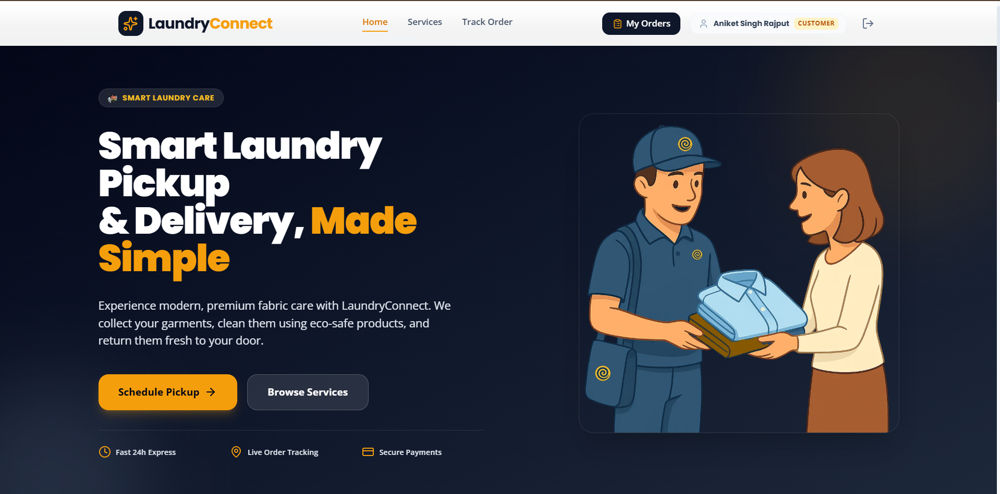
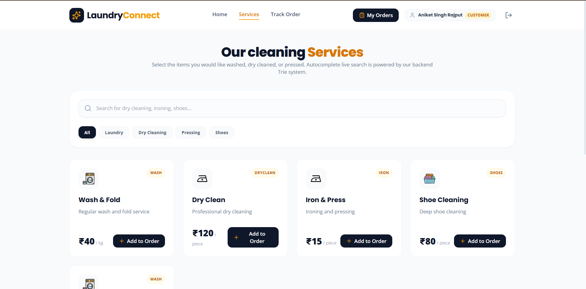
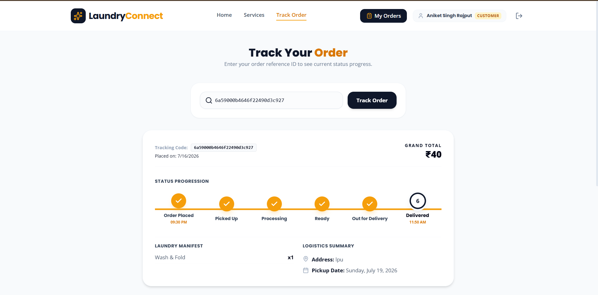
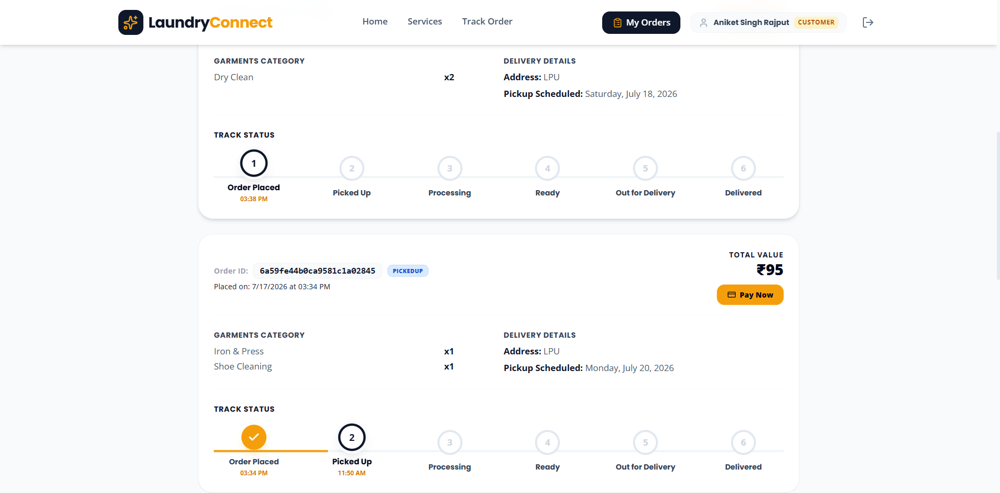

# 🧺 LaundryConnect — Smart Laundry Pickup & Delivery Platform


> A full-stack laundry pickup and delivery management platform where the
> core logistics — order prioritization, slot scheduling, and delivery
> routing — are powered by hand-built data structures and algorithms,
> not simple database queries. Built as both a production-style backend
> project and a DSA evaluation piece.

---

## Live Demo

| Link | URL |
|------|-----|
| Frontend | https://laundryconnect.vercel.app |
| Backend API Health | https://laundryconnect-api.onrender.com/ |

> Note: Backend runs on Render's free tier and spins down after periods
> of inactivity. The first request after idle time may take 30–50
> seconds to respond while the server wakes up.

---

## Screenshots






---

## What It Does

LaundryConnect automatically:
- Lets customers search services instantly via a self-built Trie autocomplete
- Schedules pickups and prevents delivery-partner double-booking using interval scheduling
- Processes orders fairly using a max-heap priority queue (express orders + wait-time aging)
- Computes optimized multi-stop delivery routes with Dijkstra's algorithm
- Pushes live order-status updates to the customer's screen via WebSockets — no polling, no refresh
- Handles mock payments, itemized invoices, and post-delivery ratings

---

## System Architecture

### Order Lifecycle Flow
Customer places order (services + pickup slot)
→ Interval scheduler checks delivery partner's slot for conflicts
→ Order priority score computed (express flag + wait-time aging)
→ Order enters the max-heap priority queue
→ Partner/Admin extracts next highest-priority order from the heap
→ Partner marks status updates (Picked Up → Washing → Ready → Delivered)
→ Each status change emits a Socket.io event to the customer in real time
→ Customer pays → invoice generated → customer rates the completed order

### Delivery Routing Flow
Partner selects multiple pending pickups for the day
→ Stops converted into a graph (Haversine distance as edge weights)
→ Dijkstra + greedy nearest-neighbor computes the shortest visiting order
→ Optimized route returned and displayed stop-by-stop

---

## Project Structure

```
laundryconnect/
├── client/                      # React (Vite) frontend
│   └── src/
│       ├── api/                 # Axios instance + Socket.io client
│       ├── components/          # StatusTimeline, StarRating, InvoiceModal, etc.
│       ├── context/             # AuthContext (JWT session state)
│       └── pages/
│           ├── customer/        # Home, Services, SchedulePickup, MyOrders, TrackOrder
│           ├── partner/         # PartnerDashboard
│           └── admin/           # AdminDashboard
├── server/                      # Express backend
│   ├── config/                  # MongoDB connection
│   ├── controllers/             # Route logic (auth, orders, services, payments...)
│   ├── middleware/              # JWT auth + role-based authorization
│   ├── models/                  # User, Order, Service, DeliveryPartner, Slot
│   ├── routes/                  # API route definitions
│   └── utils/                   # Trie, PriorityQueue, Dijkstra, interval scheduler, socket.js
├── .gitignore
└── README.md
```

---

## DSA Concepts — Where the Algorithms Actually Live

| Feature | Data Structure / Algorithm | Why It's Used |
|---|---|---|
| Service search & autocomplete | **Trie** (built from scratch) | O(prefix length) lookup, independent of catalog size |
| Order processing queue | **Max-Heap Priority Queue** (built from scratch) | O(log n) insert/extract; express + aging prevents starvation |
| Pickup slot booking | **Interval Scheduling** (sorted-sweep) | O(n log n) conflict detection instead of naive O(n²) pairwise checks |
| Delivery route optimization | **Dijkstra + Greedy Nearest-Neighbor** | Shortest-path routing across multiple stops via Haversine distance |
| Live order tracking | **WebSockets (Socket.io, room-based)** | Real-time status propagation with zero polling |

---

## API Endpoints

| Endpoint | Method | Description |
|----------|--------|-------------|
| `/api/auth/register` | POST | Register a new user (customer/partner/admin) |
| `/api/auth/login` | POST | Login, returns JWT |
| `/api/services` | GET | List all services |
| `/api/services/search?q=` | GET | Trie-powered live search |
| `/api/orders` | POST | Create a new order |
| `/api/orders/my-orders` | GET | Get logged-in customer's orders |
| `/api/orders/queue` | GET | Priority-sorted pending orders (admin/partner) |
| `/api/orders/queue/next` | GET | Extract next highest-priority order |
| `/api/orders/optimize-route` | POST | Dijkstra-optimized delivery route |
| `/api/orders/:id/status` | PATCH | Update order status (emits live socket event) |
| `/api/orders/:id/review` | POST | Submit a rating/review |
| `/api/slots` | POST | Book a delivery slot (conflict-checked) |
| `/api/payments/:orderId/pay` | POST | Process payment for an order |
| `/api/payments/:orderId/invoice` | GET | Fetch itemized invoice |

### Sample Priority Queue Response
```json
[
  {
    "order": {
      "_id": "6a5a474b77d7ff61237ea636",
      "pickupAddress": "Deep Nagar, Jalandhar",
      "isExpress": false,
      "totalAmount": 1200,
      "currentStatus": "Placed"
    },
    "priority": 27
  }
]
```

---

## Challenges Solved

| Challenge | Solution |
|-----------|----------|
| Emoji icons made the UI look like a generic template | Replaced every icon with real image assets, mapped explicitly by service category |
| Hardcoded external image URL broke the hero section | Moved all images to local `/public` assets, removed all external dependencies |
| Field-name mismatch (`review` vs `reviewComment`) silently dropped review text | Traced the schema-to-frontend mapping and corrected both read/write sites |
| Route optimizer results never rendered despite a successful API call | Found a one-character key mismatch (`optimizeRoute` vs `optimizedRoute`) between backend response and frontend state |
| Live socket updates required a manual status-change trigger | Built a dedicated `PATCH /orders/:id/status` endpoint that emits a room-scoped Socket.io event |
| Category filter tabs showed "No Services Found" for every tab | Filter labels didn't match stored `category` values in MongoDB — rebuilt the mapping to match real seeded data |

---

## Security Implementation

- **JWT Authentication** — stateless auth with role claims (customer/partner/admin)
- **Role-based Authorization Middleware** — route-level guards via `protect` + `authorize`
- **Password Hashing** — bcrypt with salt rounds on all stored credentials
- **Environment-based Secrets** — DB URI and JWT secret never committed, managed via `.env` / host environment variables
- **Ownership Checks** — payment and review endpoints verify the requesting user owns the order before allowing the action

---

## Future Enhancements

- [ ] Real payment gateway integration (Razorpay/Stripe) in place of the mocked flow
- [ ] Redis-backed persistent priority queue for multi-instance scaling
- [ ] Push notifications (web push / SMS) for status changes
- [ ] Admin analytics dashboard (revenue trends, partner performance)
- [ ] Automated partner-to-order assignment based on live location + heap priority
- [ ] PDF invoice generation instead of browser print-to-PDF

---

## Built With

- **Frontend:** React (Vite), Tailwind CSS, React Router, Socket.io Client, Axios, Lucide Icons
- **Backend:** Node.js, Express.js, Socket.io
- **Database:** MongoDB Atlas (Mongoose ODM)
- **Auth:** JWT + bcrypt
- **Hosting:** Vercel (frontend), Render (backend)

---

## Author

**Aniket Singh Rajput**
B.Tech CSE — Lovely Professional University

[](https://www.linkedin.com/in/aniket-singh-as/)
[](https://github.com/imaniketrajput)
[](https://www.instagram.com/imaniketrajput/?hl=en)

---

## 📄 License

This project is licensed under the MIT License — see the [LICENSE](LICENSE) file for details.

*Built solo | MERN Stack | Real DSA, real product*

